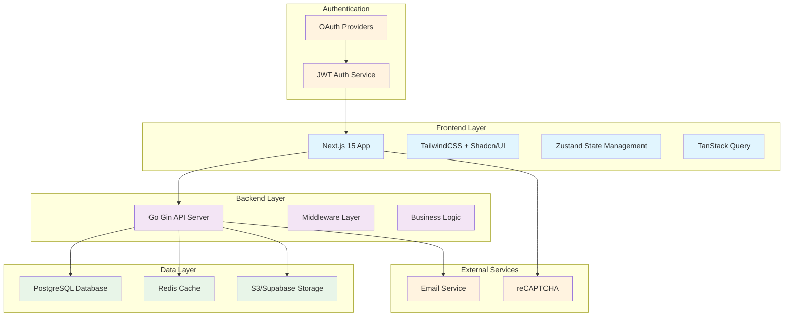
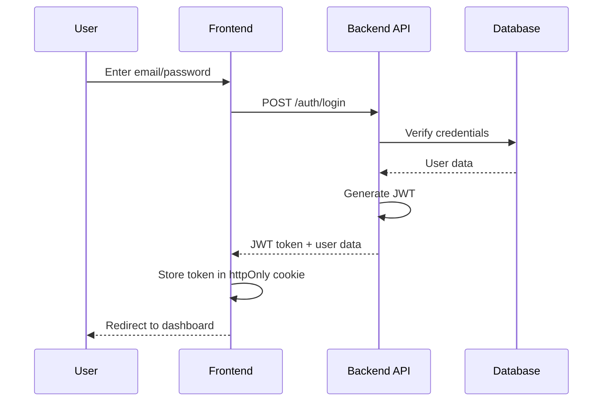
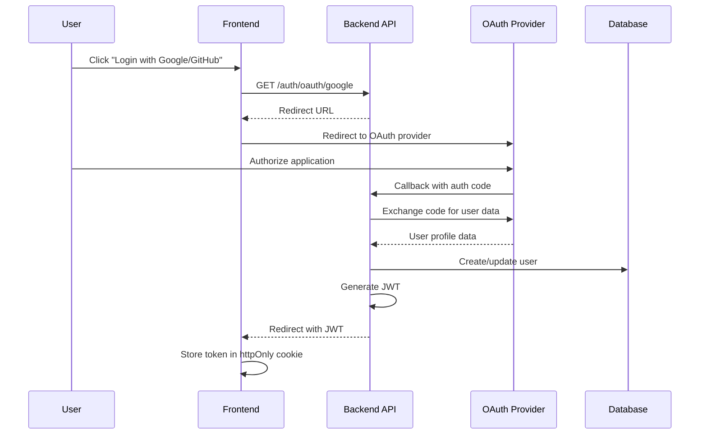

# Design Document

## Overview

BUGRELAY is designed as a modern, scalable bug tracking platform that bridges the gap between users who discover bugs and companies who need to fix them. The system architecture follows a clean separation between frontend and backend, with a focus on public accessibility, secure company verification, and efficient content management.

The platform operates on a public-first model where bug reports are immediately visible to all users, encouraging community engagement while providing companies with the tools they need to manage and respond to issues effectively.

## Architecture

### High-Level Architecture



### Technology Stack Rationale

- **Next.js 15**: Provides SSR for SEO optimization, excellent performance, and future mobile app portability
- **Go with Gin**: Offers structured, type-safe backend development with excellent performance
- **PostgreSQL**: Reliable relational database with full-text search capabilities
- **Redis**: Fast caching layer for session management and frequently accessed data
- **Custom Authentication**: JWT-based authentication with OAuth integration for Google and GitHub

## Components and Interfaces

### Frontend Components

#### Core Pages
- **Home Page**: Bug discovery and search interface
- **Bug Submission Page**: Form-based bug reporting with file upload
- **Bug Detail Page**: Individual bug view with comments and status
- **Company Dashboard**: Management interface for verified companies
- **Admin Panel**: Content moderation and platform management

#### Shared Components
- **BugCard**: Reusable bug display component with status, votes, and metadata
- **SearchFilters**: Advanced filtering interface for bug discovery
- **AuthGuard**: Route protection for authenticated features
- **FileUpload**: Screenshot and attachment handling component
- **StatusBadge**: Visual status indicators for bugs

### Backend API Structure

#### Core Endpoints

```
/api/v1/
├── bugs/
│   ├── POST /                    # Submit new bug
│   ├── GET /                     # List bugs with filters
│   ├── GET /:id                  # Get bug details
│   ├── POST /:id/vote           # Vote on bug
│   ├── POST /:id/comments       # Add comment
│   └── PATCH /:id/status        # Update status (company only)
├── companies/
│   ├── GET /                     # List companies
│   ├── GET /:id                  # Company details
│   ├── POST /:id/claim          # Initiate claim process
│   ├── POST /:id/verify         # Verify ownership
│   └── POST /:id/members        # Add team members
├── auth/
│   ├── POST /register           # User registration
│   ├── POST /login              # Email/password login
│   ├── POST /logout             # User logout
│   ├── GET /oauth/google        # Google OAuth initiation
│   ├── GET /oauth/github        # GitHub OAuth initiation
│   ├── POST /oauth/callback     # OAuth callback handler
│   ├── POST /refresh            # Refresh JWT token
│   └── GET /profile             # User profile
└── admin/
    ├── GET /bugs                # Admin bug management
    ├── PATCH /bugs/:id/moderate # Moderate content
    └── POST /bugs/merge         # Merge duplicates
```

### Authentication Flow

#### Email/Password Authentication


#### OAuth Authentication


## Data Models

### Core Entities

#### Bug Report
```typescript
interface BugReport {
  id: string
  title: string
  description: string
  status: 'open' | 'reviewing' | 'fixed' | 'wont_fix'
  priority: 'low' | 'medium' | 'high' | 'critical'
  tags: string[]
  
  // Technical details
  operatingSystem?: string
  deviceType?: string
  appVersion?: string
  browserVersion?: string
  
  // Associations
  applicationId: string
  reporterId?: string  // null for anonymous
  assignedCompanyId?: string
  
  // Engagement
  voteCount: number
  commentCount: number
  
  // Media
  screenshots: FileAttachment[]
  
  // Timestamps
  createdAt: Date
  updatedAt: Date
  resolvedAt?: Date
}
```

#### Company
```typescript
interface Company {
  id: string
  name: string
  domain: string
  isVerified: boolean
  
  // Verification
  verificationToken?: string
  verificationEmail?: string
  verifiedAt?: Date
  
  // Team management
  members: CompanyMember[]
  
  // Metadata
  createdAt: Date
  updatedAt: Date
}
```

#### User
```typescript
interface User {
  id: string
  email: string
  displayName: string
  avatarUrl?: string
  
  // Authentication
  passwordHash?: string  // null for OAuth-only users
  authProvider: 'google' | 'github' | 'email'
  authProviderId?: string  // OAuth provider ID
  
  // Email verification
  isEmailVerified: boolean
  emailVerificationToken?: string
  
  // Password reset
  passwordResetToken?: string
  passwordResetExpires?: Date
  
  // Roles
  isAdmin: boolean
  companyMemberships: CompanyMember[]
  
  // Activity
  submittedBugs: BugReport[]
  votes: BugVote[]
  comments: Comment[]
  
  createdAt: Date
  lastActiveAt: Date
}
```

### Database Schema

```sql
-- Core tables
CREATE TABLE users (
    id UUID PRIMARY KEY DEFAULT gen_random_uuid(),
    email VARCHAR(255) UNIQUE NOT NULL,
    display_name VARCHAR(100) NOT NULL,
    avatar_url TEXT,
    
    -- Authentication
    password_hash VARCHAR(255),  -- bcrypt hash, null for OAuth-only
    auth_provider VARCHAR(20) NOT NULL DEFAULT 'email',
    auth_provider_id VARCHAR(255),  -- OAuth provider user ID
    
    -- Email verification
    is_email_verified BOOLEAN DEFAULT FALSE,
    email_verification_token VARCHAR(255),
    
    -- Password reset
    password_reset_token VARCHAR(255),
    password_reset_expires TIMESTAMP,
    
    -- Roles
    is_admin BOOLEAN DEFAULT FALSE,
    
    -- Timestamps
    created_at TIMESTAMP DEFAULT NOW(),
    last_active_at TIMESTAMP DEFAULT NOW()
);

CREATE TABLE companies (
    id UUID PRIMARY KEY DEFAULT gen_random_uuid(),
    name VARCHAR(255) NOT NULL,
    domain VARCHAR(255) UNIQUE NOT NULL,
    is_verified BOOLEAN DEFAULT FALSE,
    verification_token VARCHAR(255),
    verification_email VARCHAR(255),
    verified_at TIMESTAMP,
    created_at TIMESTAMP DEFAULT NOW(),
    updated_at TIMESTAMP DEFAULT NOW()
);

CREATE TABLE applications (
    id UUID PRIMARY KEY DEFAULT gen_random_uuid(),
    name VARCHAR(255) NOT NULL,
    url TEXT,
    company_id UUID REFERENCES companies(id),
    created_at TIMESTAMP DEFAULT NOW()
);

CREATE TABLE bug_reports (
    id UUID PRIMARY KEY DEFAULT gen_random_uuid(),
    title VARCHAR(255) NOT NULL,
    description TEXT NOT NULL,
    status VARCHAR(20) DEFAULT 'open',
    priority VARCHAR(20) DEFAULT 'medium',
    tags TEXT[],
    
    -- Technical details
    operating_system VARCHAR(100),
    device_type VARCHAR(100),
    app_version VARCHAR(50),
    browser_version VARCHAR(100),
    
    -- Associations
    application_id UUID REFERENCES applications(id),
    reporter_id UUID REFERENCES users(id),
    assigned_company_id UUID REFERENCES companies(id),
    
    -- Engagement metrics
    vote_count INTEGER DEFAULT 0,
    comment_count INTEGER DEFAULT 0,
    
    -- Timestamps
    created_at TIMESTAMP DEFAULT NOW(),
    updated_at TIMESTAMP DEFAULT NOW(),
    resolved_at TIMESTAMP
);

-- Supporting tables
CREATE TABLE company_members (
    id UUID PRIMARY KEY DEFAULT gen_random_uuid(),
    company_id UUID REFERENCES companies(id),
    user_id UUID REFERENCES users(id),
    role VARCHAR(20) DEFAULT 'member',
    added_at TIMESTAMP DEFAULT NOW(),
    UNIQUE(company_id, user_id)
);

CREATE TABLE bug_votes (
    id UUID PRIMARY KEY DEFAULT gen_random_uuid(),
    bug_id UUID REFERENCES bug_reports(id),
    user_id UUID REFERENCES users(id),
    created_at TIMESTAMP DEFAULT NOW(),
    UNIQUE(bug_id, user_id)
);

CREATE TABLE comments (
    id UUID PRIMARY KEY DEFAULT gen_random_uuid(),
    bug_id UUID REFERENCES bug_reports(id),
    user_id UUID REFERENCES users(id),
    content TEXT NOT NULL,
    is_company_response BOOLEAN DEFAULT FALSE,
    created_at TIMESTAMP DEFAULT NOW(),
    updated_at TIMESTAMP DEFAULT NOW()
);

CREATE TABLE file_attachments (
    id UUID PRIMARY KEY DEFAULT gen_random_uuid(),
    bug_id UUID REFERENCES bug_reports(id),
    filename VARCHAR(255) NOT NULL,
    file_url TEXT NOT NULL,
    file_size INTEGER,
    mime_type VARCHAR(100),
    uploaded_at TIMESTAMP DEFAULT NOW()
);

-- Session management for JWT blacklisting
CREATE TABLE jwt_blacklist (
    id UUID PRIMARY KEY DEFAULT gen_random_uuid(),
    token_jti VARCHAR(255) UNIQUE NOT NULL,  -- JWT ID claim
    user_id UUID REFERENCES users(id),
    expires_at TIMESTAMP NOT NULL,
    created_at TIMESTAMP DEFAULT NOW()
);

-- Indexes for performance
CREATE INDEX idx_bug_reports_status ON bug_reports(status);
CREATE INDEX idx_bug_reports_created_at ON bug_reports(created_at DESC);
CREATE INDEX idx_bug_reports_vote_count ON bug_reports(vote_count DESC);
CREATE INDEX idx_bug_reports_application_id ON bug_reports(application_id);
CREATE INDEX idx_bug_reports_company_id ON bug_reports(assigned_company_id);
CREATE INDEX idx_users_email ON users(email);
CREATE INDEX idx_users_auth_provider ON users(auth_provider, auth_provider_id);
CREATE INDEX idx_jwt_blacklist_token ON jwt_blacklist(token_jti);
CREATE INDEX idx_jwt_blacklist_expires ON jwt_blacklist(expires_at);

-- Full-text search
CREATE INDEX idx_bug_reports_search ON bug_reports USING gin(to_tsvector('english', title || ' ' || description));
```

## Error Handling

### Frontend Error Handling
- **Network Errors**: Retry mechanism with exponential backoff
- **Validation Errors**: Real-time form validation with clear error messages
- **Authentication Errors**: Automatic redirect to login with return URL
- **Permission Errors**: Clear messaging about required permissions

### Backend Error Handling
- **Structured Error Responses**: Consistent JSON error format
- **Rate Limiting**: 429 responses with retry-after headers
- **Validation Errors**: Field-specific error messages
- **Database Errors**: Graceful handling with appropriate HTTP status codes

### Error Response Format
```typescript
interface ErrorResponse {
  error: {
    code: string
    message: string
    details?: Record<string, any>
    timestamp: string
    requestId: string
  }
}
```

## Testing Strategy

### Frontend Testing
- **Unit Tests**: Component testing with React Testing Library
- **Integration Tests**: API integration and user flow testing
- **E2E Tests**: Critical path testing with Playwright
- **Visual Regression**: Screenshot comparison for UI consistency

### Backend Testing
- **Unit Tests**: Business logic and utility function testing
- **Integration Tests**: Database and external service integration
- **API Tests**: Endpoint testing with various scenarios
- **Load Tests**: Performance testing for scalability

### Test Coverage Goals
- **Unit Tests**: 80% code coverage minimum
- **Integration Tests**: All critical user flows
- **E2E Tests**: Core functionality and edge cases
- **Performance Tests**: Response time and throughput benchmarks

### Testing Environment
- **Local Development**: Docker compose with test database
- **CI/CD Pipeline**: Automated testing on pull requests
- **Staging Environment**: Production-like testing environment
- **Monitoring**: Real-time error tracking and performance monitoring