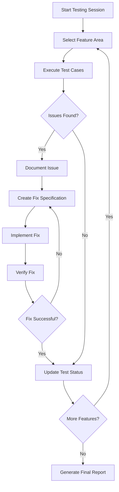

# Design Document

## Overview

This design outlines a systematic approach to manually testing the BugRelay application, identifying issues, and implementing fixes. The process will be iterative, testing one feature area at a time, documenting findings, and immediately addressing any problems discovered.

## Architecture

### Testing Flow Architecture



### Feature Testing Priority

1. **Core Infrastructure** (Health checks, basic connectivity)
2. **Bug Submission** (Anonymous and authenticated)
3. **User Authentication** (Registration, login, OAuth)
4. **Bug Browsing** (Search, filter, sort, view)
5. **User Interaction** (Comments, voting)
6. **Company Management** (Claiming, verification, status updates)
7. **Administrative Features** (Moderation, admin dashboard)

## Components and Interfaces

### Testing Framework Components

#### 1. Test Executor
- **Purpose**: Execute manual test cases and capture results
- **Interface**: Interactive testing with real browser and API calls
- **Responsibilities**:
  - Navigate through application features
  - Perform user actions (clicks, form submissions, etc.)
  - Capture screenshots and error messages
  - Document test results

#### 2. Issue Tracker
- **Purpose**: Document and categorize discovered issues
- **Interface**: Structured issue documentation format
- **Responsibilities**:
  - Record bug details and reproduction steps
  - Classify issues by severity and type
  - Track fix status and verification results

#### 3. Fix Implementation Engine
- **Purpose**: Implement fixes for discovered issues
- **Interface**: Code modification and testing tools
- **Responsibilities**:
  - Analyze issue root causes
  - Implement appropriate fixes
  - Test fixes in isolation
  - Integrate fixes with existing codebase

#### 4. Verification System
- **Purpose**: Verify that fixes resolve issues without breaking other features
- **Interface**: Automated and manual verification processes
- **Responsibilities**:
  - Re-test fixed functionality
  - Perform regression testing
  - Validate fix completeness

## Data Models

### Test Case Model
```typescript
interface TestCase {
  id: string;
  featureArea: string;
  description: string;
  steps: string[];
  expectedResult: string;
  actualResult?: string;
  status: 'pending' | 'passed' | 'failed' | 'blocked';
  issues?: Issue[];
}
```

### Issue Model
```typescript
interface Issue {
  id: string;
  title: string;
  description: string;
  severity: 'critical' | 'high' | 'medium' | 'low';
  type: 'bug' | 'missing_feature' | 'ui_issue' | 'performance';
  reproductionSteps: string[];
  expectedBehavior: string;
  actualBehavior: string;
  affectedComponents: string[];
  status: 'open' | 'in_progress' | 'fixed' | 'verified';
  fixDescription?: string;
}
```

### Test Session Model
```typescript
interface TestSession {
  id: string;
  startTime: Date;
  endTime?: Date;
  featureAreasTested: string[];
  totalTestCases: number;
  passedTests: number;
  failedTests: number;
  issuesFound: Issue[];
  fixesImplemented: number;
  status: 'in_progress' | 'completed';
}
```

## Error Handling

### Issue Classification System

#### Critical Issues
- Application crashes or fails to start
- Data loss or corruption
- Security vulnerabilities
- Complete feature non-functionality

#### High Priority Issues
- Core features not working as expected
- Authentication failures
- Data inconsistencies
- Poor user experience in main workflows

#### Medium Priority Issues
- Minor feature bugs
- UI inconsistencies
- Performance issues
- Missing validation messages

#### Low Priority Issues
- Cosmetic UI problems
- Minor text issues
- Non-critical feature enhancements

### Fix Implementation Strategy

#### Immediate Fixes (Critical/High)
1. Stop testing current feature area
2. Implement fix immediately
3. Verify fix works
4. Resume testing

#### Batched Fixes (Medium/Low)
1. Continue testing to completion
2. Group similar issues
3. Implement fixes in batches
4. Verify all fixes together

## Testing Strategy

### Manual Testing Approach

#### 1. Feature Area Testing
- Test each feature area comprehensively
- Follow user workflows end-to-end
- Test both happy path and edge cases
- Verify error handling and validation

#### 2. Cross-Browser Testing
- Test in Chrome (primary)
- Test in Firefox
- Test in Safari (if available)
- Document browser-specific issues

#### 3. Responsive Testing
- Test on desktop (1920x1080)
- Test on tablet (768px width)
- Test on mobile (375px width)
- Verify responsive behavior

#### 4. API Testing
- Test API endpoints directly
- Verify request/response formats
- Test authentication and authorization
- Check error responses

### Test Data Management

#### Test Users
- Create test accounts for different user types
- Use consistent test data across sessions
- Clean up test data after sessions

#### Test Companies
- Create test companies for verification testing
- Use test email domains for verification
- Document test company credentials

#### Test Bug Reports
- Create diverse bug reports for testing
- Include various file types and sizes
- Test with different content types

## Integration Points

### Frontend Testing
- Next.js application functionality
- React component behavior
- State management (Zustand)
- API integration
- Authentication flows

### Backend Testing
- Go/Gin API endpoints
- Database operations
- Authentication middleware
- File upload handling
- Rate limiting

### Database Testing
- PostgreSQL data integrity
- Redis caching behavior
- Migration status
- Data relationships

### External Services
- OAuth provider integration
- File storage (S3/Supabase)
- Email services (MailHog in dev)

## Performance Considerations

### Testing Performance
- Monitor page load times
- Check API response times
- Verify database query performance
- Test file upload speeds

### Fix Implementation Performance
- Minimize testing downtime
- Implement fixes incrementally
- Use hot reload for frontend changes
- Restart services only when necessary

## Security Testing

### Authentication Security
- Test JWT token handling
- Verify OAuth flow security
- Check session management
- Test logout functionality

### Authorization Testing
- Verify role-based access control
- Test company verification process
- Check admin-only features
- Validate API permissions

### Input Validation
- Test XSS prevention
- Verify SQL injection protection
- Check file upload security
- Test rate limiting effectiveness