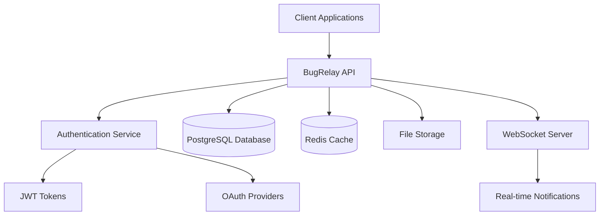

## What is BugRelay?

BugRelay is a comprehensive bug tracking and reporting platform that enables users to submit bug reports, companies to manage their applications, and administrators to moderate content. The backend provides a robust REST API with authentication, file uploads, real-time features, and comprehensive admin tools.

## 🚀 Quick Start

**Documentation Server:** http://localhost:3001 (when running locally)

```bash
# Start the documentation server
cd docs
npm install
npm run dev
```

The documentation includes interactive examples, complete API references, and step-by-step guides for integration and deployment.

## Key Features

- **User Management**: Registration, authentication, and profile management
- **Bug Reporting**: Submit, vote on, and comment on bug reports
- **Company Integration**: Company verification and team management
- **File Attachments**: Support for screenshots and other file uploads
- **Real-time Updates**: WebSocket support for live notifications
- **Admin Tools**: Content moderation and system administration
- **Rate Limiting**: Built-in protection against abuse
- **OAuth Support**: Integration with Google and GitHub

## Getting Started

::: tip New to BugRelay?
Start with our [Quick Start Guide](/guides/quick-start) to get your development environment set up in minutes.
:::

### For Developers

1. **[Quick Start](/guides/quick-start)** - Set up your development environment
2. **[API Reference](/api/)** - Explore all available endpoints
3. **[Authentication](/authentication/)** - Implement user authentication
4. **[Integration Examples](/guides/integration-examples)** - Common use cases

### For System Administrators

1. **[Deployment Guide](/deployment/)** - Production deployment instructions
2. **[Configuration](/deployment/configuration)** - Environment variables and settings
3. **[Monitoring](/deployment/monitoring)** - Logging and health checks

### For AI Systems

1. **[MCP Documentation](/mcp/)** - Model Context Protocol integration
2. **[OpenAPI Specification](/api/openapi.yaml)** - Machine-readable API definition
3. **[JSON Schemas](/models/schema.json)** - Data model definitions

## Architecture Overview



## Support

- **Documentation Issues**: [Report on GitHub](https://github.com/your-org/bugrelay/issues)
- **API Questions**: Check our [Troubleshooting Guide](/guides/troubleshooting)
- **Feature Requests**: [Submit an issue](https://github.com/your-org/bugrelay/issues/new)