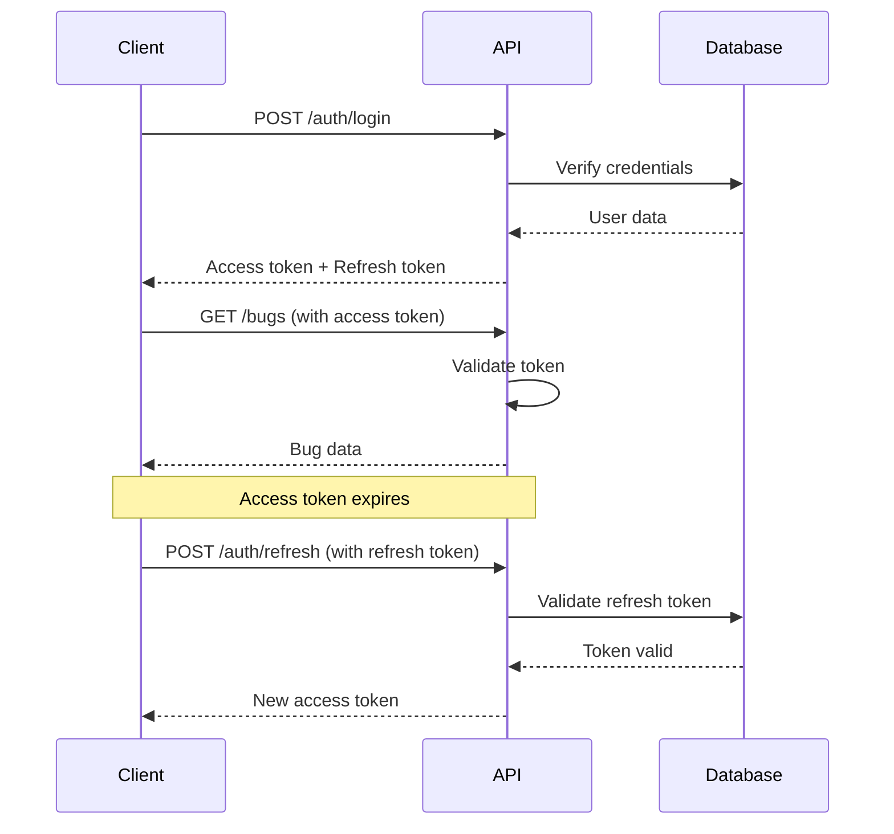

# Authentication

The BugRelay API uses JWT (JSON Web Token) based authentication with support for refresh tokens, OAuth integration, and secure session management.

## Overview

Authentication in BugRelay provides:

- **JWT Access Tokens** - Short-lived tokens for API access (1 hour default)
- **Refresh Tokens** - Long-lived tokens for obtaining new access tokens (30 days default)
- **OAuth Integration** - Support for Google, GitHub, and other providers
- **Session Management** - Secure token storage and rotation
- **Role-Based Access** - User and admin permission levels

## Quick Start

### 1. Register a New User

```bash
curl -X POST https://api.bugrelay.com/api/v1/auth/register \
  -H "Content-Type: application/json" \
  -d '{
    "email": "user@example.com",
    "password": "securepassword123",
    "display_name": "John Doe"
  }'
```

### 2. Login

```bash
curl -X POST https://api.bugrelay.com/api/v1/auth/login \
  -H "Content-Type: application/json" \
  -d '{
    "email": "user@example.com",
    "password": "securepassword123"
  }'
```

### 3. Use Access Token

```bash
curl -H "Authorization: Bearer YOUR_ACCESS_TOKEN" \
  https://api.bugrelay.com/api/v1/bugs
```

## Authentication Flow



## Token Types

### Access Tokens

- **Purpose**: Authenticate API requests
- **Lifetime**: 1 hour (configurable)
- **Storage**: Memory or secure storage only
- **Format**: JWT with user claims

**Example Access Token Payload:**
```json
{
  "sub": "123e4567-e89b-12d3-a456-426614174000",
  "email": "user@example.com",
  "display_name": "John Doe",
  "is_admin": false,
  "company_id": "456e7890-e89b-12d3-a456-426614174000",
  "iat": 1640995200,
  "exp": 1640998800,
  "iss": "bugrelay-api",
  "aud": "bugrelay-client"
}
```

### Refresh Tokens

- **Purpose**: Obtain new access tokens
- **Lifetime**: 30 days (configurable)
- **Storage**: Secure HTTP-only cookies (recommended)
- **Format**: Opaque token stored in database

## Implementation Guide

### Client-Side Implementation

#### JavaScript/Browser

```javascript
class BugRelayAuth {
  constructor(baseUrl) {
    this.baseUrl = baseUrl;
    this.accessToken = localStorage.getItem('access_token');
  }

  async login(email, password) {
    const response = await fetch(`${this.baseUrl}/api/v1/auth/login`, {
      method: 'POST',
      headers: { 'Content-Type': 'application/json' },
      body: JSON.stringify({ email, password }),
      credentials: 'include' // Include cookies for refresh token
    });

    const data = await response.json();
    
    if (data.success) {
      this.accessToken = data.data.access_token;
      localStorage.setItem('access_token', this.accessToken);
      return data.data.user;
    }
    
    throw new Error(data.error.message);
  }

  async makeAuthenticatedRequest(url, options = {}) {
    const headers = {
      'Authorization': `Bearer ${this.accessToken}`,
      'Content-Type': 'application/json',
      ...options.headers
    };

    let response = await fetch(url, { ...options, headers });

    // If token expired, try to refresh
    if (response.status === 401) {
      await this.refreshToken();
      headers['Authorization'] = `Bearer ${this.accessToken}`;
      response = await fetch(url, { ...options, headers });
    }

    return response;
  }

  async refreshToken() {
    const response = await fetch(`${this.baseUrl}/api/v1/auth/refresh`, {
      method: 'POST',
      credentials: 'include' // Send refresh token cookie
    });

    const data = await response.json();
    
    if (data.success) {
      this.accessToken = data.data.access_token;
      localStorage.setItem('access_token', this.accessToken);
    } else {
      // Refresh failed, redirect to login
      this.logout();
      throw new Error('Session expired');
    }
  }

  logout() {
    this.accessToken = null;
    localStorage.removeItem('access_token');
    
    // Clear refresh token
    fetch(`${this.baseUrl}/api/v1/auth/logout`, {
      method: 'POST',
      credentials: 'include'
    });
  }
}

// Usage
const auth = new BugRelayAuth('https://api.bugrelay.com');

// Login
try {
  const user = await auth.login('user@example.com', 'password');
  console.log('Logged in:', user.display_name);
} catch (error) {
  console.error('Login failed:', error.message);
}

// Make authenticated requests
const response = await auth.makeAuthenticatedRequest('/api/v1/bugs');
const bugs = await response.json();
```

#### React Hook

```javascript
import { useState, useEffect, useContext, createContext } from 'react';

const AuthContext = createContext();

export function AuthProvider({ children }) {
  const [user, setUser] = useState(null);
  const [loading, setLoading] = useState(true);
  const auth = new BugRelayAuth('https://api.bugrelay.com');

  useEffect(() => {
    // Check if user is already logged in
    const token = localStorage.getItem('access_token');
    if (token) {
      auth.accessToken = token;
      // Verify token and get user info
      auth.makeAuthenticatedRequest('/api/v1/auth/me')
        .then(response => response.json())
        .then(data => {
          if (data.success) {
            setUser(data.data);
          }
        })
        .catch(() => {
          // Token invalid, clear it
          localStorage.removeItem('access_token');
        })
        .finally(() => setLoading(false));
    } else {
      setLoading(false);
    }
  }, []);

  const login = async (email, password) => {
    const userData = await auth.login(email, password);
    setUser(userData);
    return userData;
  };

  const logout = () => {
    auth.logout();
    setUser(null);
  };

  const value = {
    user,
    login,
    logout,
    loading,
    makeRequest: auth.makeAuthenticatedRequest.bind(auth)
  };

  return (
    <AuthContext.Provider value={value}>
      {children}
    </AuthContext.Provider>
  );
}

export function useAuth() {
  const context = useContext(AuthContext);
  if (!context) {
    throw new Error('useAuth must be used within AuthProvider');
  }
  return context;
}

// Usage in components
function LoginForm() {
  const { login } = useAuth();
  const [email, setEmail] = useState('');
  const [password, setPassword] = useState('');

  const handleSubmit = async (e) => {
    e.preventDefault();
    try {
      await login(email, password);
      // Redirect to dashboard
    } catch (error) {
      alert('Login failed: ' + error.message);
    }
  };

  return (
    <form onSubmit={handleSubmit}>
      <input 
        type="email" 
        value={email} 
        onChange={(e) => setEmail(e.target.value)}
        placeholder="Email"
        required 
      />
      <input 
        type="password" 
        value={password} 
        onChange={(e) => setPassword(e.target.value)}
        placeholder="Password"
        required 
      />
      <button type="submit">Login</button>
    </form>
  );
}
```

### Server-Side Implementation

#### Node.js/Express Middleware

```javascript
const jwt = require('jsonwebtoken');

function authenticateToken(req, res, next) {
  const authHeader = req.headers['authorization'];
  const token = authHeader && authHeader.split(' ')[1]; // Bearer TOKEN

  if (!token) {
    return res.status(401).json({
      success: false,
      error: {
        code: 'MISSING_TOKEN',
        message: 'Access token required'
      }
    });
  }

  jwt.verify(token, process.env.JWT_SECRET, (err, user) => {
    if (err) {
      return res.status(403).json({
        success: false,
        error: {
          code: 'INVALID_TOKEN',
          message: 'Invalid or expired token'
        }
      });
    }

    req.user = user;
    next();
  });
}

// Usage
app.get('/api/v1/bugs', authenticateToken, (req, res) => {
  // req.user contains the decoded JWT payload
  const userId = req.user.sub;
  // ... fetch bugs for user
});
```

## OAuth Integration

### Google OAuth

```javascript
// Frontend - initiate OAuth flow
function loginWithGoogle() {
  const params = new URLSearchParams({
    client_id: 'your-google-client-id',
    redirect_uri: 'https://yourapp.com/auth/google/callback',
    response_type: 'code',
    scope: 'openid email profile',
    state: generateRandomState() // CSRF protection
  });
  
  window.location.href = `https://accounts.google.com/o/oauth2/v2/auth?${params}`;
}

// Backend - handle OAuth callback
app.get('/auth/google/callback', async (req, res) => {
  const { code, state } = req.query;
  
  // Verify state parameter for CSRF protection
  if (!verifyState(state)) {
    return res.status(400).json({ error: 'Invalid state parameter' });
  }
  
  try {
    // Exchange code for tokens
    const tokenResponse = await fetch('https://oauth2.googleapis.com/token', {
      method: 'POST',
      headers: { 'Content-Type': 'application/json' },
      body: JSON.stringify({
        client_id: process.env.GOOGLE_CLIENT_ID,
        client_secret: process.env.GOOGLE_CLIENT_SECRET,
        code,
        grant_type: 'authorization_code',
        redirect_uri: 'https://yourapp.com/auth/google/callback'
      })
    });
    
    const tokens = await tokenResponse.json();
    
    // Get user info from Google
    const userResponse = await fetch('https://www.googleapis.com/oauth2/v2/userinfo', {
      headers: { 'Authorization': `Bearer ${tokens.access_token}` }
    });
    
    const googleUser = await userResponse.json();
    
    // Create or update user in your database
    const user = await findOrCreateUser({
      email: googleUser.email,
      display_name: googleUser.name,
      google_id: googleUser.id
    });
    
    // Generate your own JWT tokens
    const accessToken = generateAccessToken(user);
    const refreshToken = generateRefreshToken(user);
    
    // Set refresh token as HTTP-only cookie
    res.cookie('refresh_token', refreshToken, {
      httpOnly: true,
      secure: true,
      sameSite: 'strict',
      maxAge: 30 * 24 * 60 * 60 * 1000 // 30 days
    });
    
    // Redirect with access token
    res.redirect(`https://yourapp.com/auth/success?token=${accessToken}`);
    
  } catch (error) {
    res.status(500).json({ error: 'OAuth authentication failed' });
  }
});
```

## Security Best Practices

### Token Storage

**✅ Recommended:**
- Store access tokens in memory or sessionStorage
- Store refresh tokens in HTTP-only cookies
- Use secure, sameSite cookies in production

**❌ Avoid:**
- Storing tokens in localStorage (XSS vulnerable)
- Storing refresh tokens in client-side storage
- Transmitting tokens in URL parameters

### Token Validation

```javascript
// Always validate tokens server-side
function validateToken(token) {
  try {
    const decoded = jwt.verify(token, process.env.JWT_SECRET);
    
    // Check token expiration
    if (decoded.exp < Date.now() / 1000) {
      throw new Error('Token expired');
    }
    
    // Check issuer and audience
    if (decoded.iss !== 'bugrelay-api' || decoded.aud !== 'bugrelay-client') {
      throw new Error('Invalid token claims');
    }
    
    return decoded;
  } catch (error) {
    throw new Error('Invalid token');
  }
}
```

### Rate Limiting

```javascript
// Implement rate limiting for auth endpoints
const rateLimit = require('express-rate-limit');

const authLimiter = rateLimit({
  windowMs: 15 * 60 * 1000, // 15 minutes
  max: 5, // 5 attempts per window
  message: {
    success: false,
    error: {
      code: 'RATE_LIMIT_EXCEEDED',
      message: 'Too many authentication attempts'
    }
  },
  standardHeaders: true,
  legacyHeaders: false
});

app.use('/api/v1/auth/login', authLimiter);
app.use('/api/v1/auth/register', authLimiter);
```

## Error Handling

### Common Authentication Errors

| Error Code | HTTP Status | Description | Solution |
|------------|-------------|-------------|----------|
| `MISSING_TOKEN` | 401 | No authorization header | Include `Authorization: Bearer <token>` |
| `INVALID_TOKEN` | 403 | Token invalid or expired | Refresh token or re-authenticate |
| `INSUFFICIENT_PERMISSIONS` | 403 | User lacks required permissions | Contact administrator |
| `RATE_LIMIT_EXCEEDED` | 429 | Too many auth attempts | Wait before retrying |
| `INVALID_CREDENTIALS` | 401 | Wrong email/password | Check credentials |
| `EMAIL_NOT_VERIFIED` | 403 | Email verification required | Check email for verification link |

### Error Response Format

```json
{
  "success": false,
  "error": {
    "code": "INVALID_TOKEN",
    "message": "The provided token is invalid or expired",
    "details": {
      "reason": "token_expired",
      "expired_at": "2023-01-01T13:00:00Z"
    }
  }
}
```

## Testing Authentication

### Unit Tests

```javascript
const request = require('supertest');
const app = require('../app');

describe('Authentication', () => {
  test('should login with valid credentials', async () => {
    const response = await request(app)
      .post('/api/v1/auth/login')
      .send({
        email: 'test@example.com',
        password: 'password123'
      });
    
    expect(response.status).toBe(200);
    expect(response.body.success).toBe(true);
    expect(response.body.data.access_token).toBeDefined();
  });
  
  test('should reject invalid credentials', async () => {
    const response = await request(app)
      .post('/api/v1/auth/login')
      .send({
        email: 'test@example.com',
        password: 'wrongpassword'
      });
    
    expect(response.status).toBe(401);
    expect(response.body.success).toBe(false);
  });
  
  test('should require authentication for protected routes', async () => {
    const response = await request(app)
      .get('/api/v1/bugs');
    
    expect(response.status).toBe(401);
  });
});
```

## Advanced Topics

- [JWT Implementation Details](./jwt)
- [OAuth Integration Guide](./oauth)
- [Security Considerations](./security)
- [Multi-Factor Authentication](./mfa)
- [Session Management](./sessions)

For more detailed implementation examples, see our [Authentication Flows](./flows) documentation.