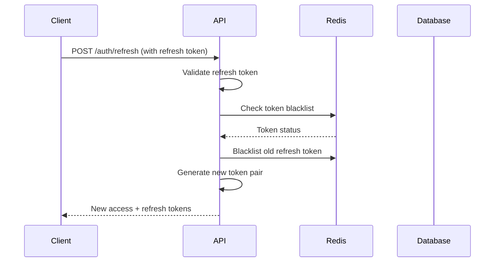

# JWT Implementation

This document provides detailed information about JWT (JSON Web Token) implementation in BugRelay, including token structure, validation mechanisms, and refresh token handling.

## Overview

BugRelay uses JWT tokens for stateless authentication with the following features:

- **HMAC-SHA256 Signing**: Cryptographically secure token signing
- **Token Pair System**: Separate access and refresh tokens
- **Token Blacklisting**: Revocation support via Redis and database
- **Automatic Expiration**: Configurable token lifetimes
- **Claims Validation**: Comprehensive token validation

## Token Structure

### JWT Claims

BugRelay JWT tokens contain both standard and custom claims:

```json
{
  "user_id": "550e8400-e29b-41d4-a716-446655440000",
  "email": "user@example.com",
  "is_admin": false,
  "token_type": "access",
  "jti": "123e4567-e89b-12d3-a456-426614174000",
  "sub": "550e8400-e29b-41d4-a716-446655440000",
  "iat": 1640995200,
  "exp": 1640998800,
  "nbf": 1640995200,
  "iss": "bugrelay",
  "aud": ["bugrelay-users"]
}
```

### Custom Claims

| Claim | Type | Description |
|-------|------|-------------|
| `user_id` | string | Unique user identifier (UUID) |
| `email` | string | User's email address |
| `is_admin` | boolean | Administrative privileges flag |
| `token_type` | string | Token type: "access" or "refresh" |

### Standard Claims

| Claim | Description |
|-------|-------------|
| `jti` | JWT ID - unique token identifier for blacklisting |
| `sub` | Subject - same as user_id |
| `iat` | Issued at timestamp |
| `exp` | Expiration timestamp |
| `nbf` | Not before timestamp |
| `iss` | Issuer - always "bugrelay" |
| `aud` | Audience - always ["bugrelay-users"] |

## Token Types

### Access Tokens

Access tokens are short-lived tokens used for API authentication:

- **Purpose**: Authenticate API requests
- **Lifetime**: 15 minutes (configurable via `JWT_ACCESS_TOKEN_TTL`)
- **Usage**: Include in `Authorization: Bearer <token>` header
- **Security**: Stored in memory or sessionStorage (client-side)

**Example Access Token Generation:**
```go
accessToken, err := jwtService.generateToken(
    userID, 
    email, 
    isAdmin, 
    "access", 
    15*time.Minute
)
```

### Refresh Tokens

Refresh tokens are long-lived tokens used to obtain new access tokens:

- **Purpose**: Generate new access tokens without re-authentication
- **Lifetime**: 7 days (configurable via `JWT_REFRESH_TOKEN_TTL`)
- **Usage**: Send to `/api/v1/auth/refresh` endpoint
- **Security**: Stored in HTTP-only cookies (recommended)

**Example Refresh Token Generation:**
```go
refreshToken, err := jwtService.generateToken(
    userID, 
    email, 
    isAdmin, 
    "refresh", 
    7*24*time.Hour
)
```

## Token Generation

### Token Pair Generation

The system generates both access and refresh tokens simultaneously:

```go
func (j *JWTService) GenerateTokenPair(userID, email string, isAdmin bool) (accessToken, refreshToken string, err error) {
    // Generate access token
    accessToken, err = j.generateToken(userID, email, isAdmin, "access", j.accessTokenTTL)
    if err != nil {
        return "", "", fmt.Errorf("failed to generate access token: %w", err)
    }

    // Generate refresh token
    refreshToken, err = j.generateToken(userID, email, isAdmin, "refresh", j.refreshTokenTTL)
    if err != nil {
        return "", "", fmt.Errorf("failed to generate refresh token: %w", err)
    }

    return accessToken, refreshToken, nil
}
```

### Token Creation Process

1. **Generate JWT ID**: Create unique identifier using UUID
2. **Set Claims**: Populate both custom and standard claims
3. **Set Timestamps**: Configure issued at, expiration, and not before times
4. **Sign Token**: Use HMAC-SHA256 with secret key
5. **Return Token**: Provide signed JWT string

```go
func (j *JWTService) generateToken(userID, email string, isAdmin bool, tokenType string, ttl time.Duration) (string, error) {
    now := time.Now()
    jti := uuid.New().String()

    claims := JWTClaims{
        UserID:    userID,
        Email:     email,
        IsAdmin:   isAdmin,
        TokenType: tokenType,
        RegisteredClaims: jwt.RegisteredClaims{
            ID:        jti,
            Subject:   userID,
            IssuedAt:  jwt.NewNumericDate(now),
            ExpiresAt: jwt.NewNumericDate(now.Add(ttl)),
            NotBefore: jwt.NewNumericDate(now),
            Issuer:    "bugrelay",
            Audience:  []string{"bugrelay-users"},
        },
    }

    token := jwt.NewWithClaims(jwt.SigningMethodHS256, claims)
    return token.SignedString(j.secretKey)
}
```

## Token Validation

### Validation Process

Token validation follows a multi-step process:

1. **Parse JWT**: Extract and decode token structure
2. **Verify Signature**: Validate HMAC-SHA256 signature
3. **Check Expiration**: Ensure token hasn't expired
4. **Validate Claims**: Verify issuer, audience, and custom claims
5. **Check Blacklist**: Ensure token hasn't been revoked

```go
func (j *JWTService) ValidateToken(tokenString string) (*JWTClaims, error) {
    token, err := jwt.ParseWithClaims(tokenString, &JWTClaims{}, func(token *jwt.Token) (interface{}, error) {
        if _, ok := token.Method.(*jwt.SigningMethodHMAC); !ok {
            return nil, fmt.Errorf("unexpected signing method: %v", token.Header["alg"])
        }
        return j.secretKey, nil
    })

    if err != nil {
        if errors.Is(err, jwt.ErrTokenExpired) {
            return nil, ErrExpiredToken
        }
        return nil, ErrInvalidToken
    }

    claims, ok := token.Claims.(*JWTClaims)
    if !ok || !token.Valid {
        return nil, ErrTokenClaims
    }

    return claims, nil
}
```

### Access Token Validation

Access tokens require additional validation for token type and blacklist checking:

```go
func (s *Service) ValidateAccessToken(tokenString string) (*JWTClaims, error) {
    claims, err := s.jwtService.ValidateToken(tokenString)
    if err != nil {
        return nil, err
    }

    if claims.TokenType != "access" {
        return nil, fmt.Errorf("invalid token type: expected access, got %s", claims.TokenType)
    }

    // Check if token is blacklisted
    isBlacklisted, err := s.blacklistService.IsTokenBlacklisted(context.Background(), claims.ID)
    if err != nil {
        return nil, fmt.Errorf("failed to check token blacklist: %w", err)
    }

    if isBlacklisted {
        return nil, fmt.Errorf("token has been revoked")
    }

    return claims, nil
}
```

## Token Refresh Mechanism

### Refresh Flow

The token refresh process ensures continuous authentication without requiring user re-login:



### Refresh Implementation

```go
func (s *Service) RefreshTokens(refreshTokenString string) (accessToken, refreshToken string, err error) {
    claims, err := s.jwtService.ValidateToken(refreshTokenString)
    if err != nil {
        return "", "", fmt.Errorf("invalid refresh token: %w", err)
    }

    if claims.TokenType != "refresh" {
        return "", "", fmt.Errorf("invalid token type: expected refresh, got %s", claims.TokenType)
    }

    // Check if token is blacklisted
    isBlacklisted, err := s.blacklistService.IsTokenBlacklisted(context.Background(), claims.ID)
    if err != nil {
        return "", "", fmt.Errorf("failed to check token blacklist: %w", err)
    }

    if isBlacklisted {
        return "", "", fmt.Errorf("refresh token has been revoked")
    }

    // Blacklist the old refresh token
    err = s.blacklistService.BlacklistToken(context.Background(), claims.ID, claims.UserID, claims.ExpiresAt.Time)
    if err != nil {
        return "", "", fmt.Errorf("failed to blacklist old refresh token: %w", err)
    }

    // Generate new token pair
    return s.jwtService.GenerateTokenPair(claims.UserID, claims.Email, claims.IsAdmin)
}
```

### Refresh Token Rotation

BugRelay implements refresh token rotation for enhanced security:

1. **Validate Refresh Token**: Ensure token is valid and not blacklisted
2. **Blacklist Old Token**: Add current refresh token to blacklist
3. **Generate New Pair**: Create new access and refresh tokens
4. **Return Tokens**: Provide new token pair to client

This prevents refresh token reuse and limits the impact of token compromise.

## Token Blacklisting

### Blacklist System

BugRelay implements a dual-layer token blacklisting system:

- **Redis**: Fast lookup for active token validation
- **Database**: Persistent storage for audit and cleanup

### Blacklist Operations

#### Individual Token Revocation
```go
func (s *Service) RevokeToken(tokenString string) error {
    claims, err := s.jwtService.ValidateToken(tokenString)
    if err != nil {
        return fmt.Errorf("invalid token: %w", err)
    }

    return s.blacklistService.BlacklistToken(context.Background(), claims.ID, claims.UserID, claims.ExpiresAt.Time)
}
```

#### User Token Revocation
```go
func (s *Service) RevokeAllUserTokens(userID string) error {
    return s.blacklistService.BlacklistAllUserTokens(context.Background(), userID)
}
```

### Blacklist Triggers

Tokens are automatically blacklisted in the following scenarios:

- **User Logout**: All user tokens revoked
- **Password Change**: All user tokens revoked for security
- **Account Suspension**: All user tokens revoked
- **Refresh Token Use**: Old refresh token blacklisted
- **Security Incident**: Manual token revocation

## Configuration

### Environment Variables

```bash
# JWT Secret Key (required)
JWT_SECRET=your-secure-256-bit-secret-key

# Token Lifetimes
JWT_ACCESS_TOKEN_TTL=15m
JWT_REFRESH_TOKEN_TTL=168h

# Redis Configuration (for blacklisting)
REDIS_HOST=localhost
REDIS_PORT=6379
REDIS_PASSWORD=your-redis-password
```

### Security Considerations

#### Secret Key Management
- **Length**: Minimum 256 bits (32 bytes)
- **Randomness**: Use cryptographically secure random generation
- **Rotation**: Rotate secrets regularly in production
- **Storage**: Store in secure environment variables or key management systems

#### Token Lifetime Configuration
- **Access Tokens**: Short lifetime (15 minutes recommended)
- **Refresh Tokens**: Moderate lifetime (7 days recommended)
- **Balance**: Security vs. user experience

## Client Implementation Examples

### JavaScript/Browser

```javascript
class JWTManager {
    constructor(baseUrl) {
        this.baseUrl = baseUrl;
        this.accessToken = sessionStorage.getItem('access_token');
    }

    async makeAuthenticatedRequest(url, options = {}) {
        const headers = {
            'Authorization': `Bearer ${this.accessToken}`,
            'Content-Type': 'application/json',
            ...options.headers
        };

        let response = await fetch(url, { ...options, headers });

        // Handle token expiration
        if (response.status === 401) {
            const refreshed = await this.refreshTokens();
            if (refreshed) {
                headers['Authorization'] = `Bearer ${this.accessToken}`;
                response = await fetch(url, { ...options, headers });
            } else {
                throw new Error('Authentication failed');
            }
        }

        return response;
    }

    async refreshTokens() {
        try {
            const response = await fetch(`${this.baseUrl}/api/v1/auth/refresh`, {
                method: 'POST',
                credentials: 'include' // Send refresh token cookie
            });

            const data = await response.json();
            
            if (data.success) {
                this.accessToken = data.data.access_token;
                sessionStorage.setItem('access_token', this.accessToken);
                return true;
            }
        } catch (error) {
            console.error('Token refresh failed:', error);
        }

        // Refresh failed, clear tokens and redirect to login
        this.clearTokens();
        return false;
    }

    clearTokens() {
        this.accessToken = null;
        sessionStorage.removeItem('access_token');
        
        // Clear refresh token cookie
        fetch(`${this.baseUrl}/api/v1/auth/logout`, {
            method: 'POST',
            credentials: 'include'
        });
    }
}
```

### React Hook

```javascript
import { useState, useEffect, useCallback } from 'react';

export function useJWT(baseUrl) {
    const [accessToken, setAccessToken] = useState(
        sessionStorage.getItem('access_token')
    );
    const [isAuthenticated, setIsAuthenticated] = useState(!!accessToken);

    const makeAuthenticatedRequest = useCallback(async (url, options = {}) => {
        if (!accessToken) {
            throw new Error('No access token available');
        }

        const headers = {
            'Authorization': `Bearer ${accessToken}`,
            'Content-Type': 'application/json',
            ...options.headers
        };

        let response = await fetch(url, { ...options, headers });

        if (response.status === 401) {
            const refreshed = await refreshTokens();
            if (refreshed) {
                headers['Authorization'] = `Bearer ${accessToken}`;
                response = await fetch(url, { ...options, headers });
            } else {
                throw new Error('Authentication failed');
            }
        }

        return response;
    }, [accessToken]);

    const refreshTokens = useCallback(async () => {
        try {
            const response = await fetch(`${baseUrl}/api/v1/auth/refresh`, {
                method: 'POST',
                credentials: 'include'
            });

            const data = await response.json();
            
            if (data.success) {
                const newToken = data.data.access_token;
                setAccessToken(newToken);
                sessionStorage.setItem('access_token', newToken);
                setIsAuthenticated(true);
                return true;
            }
        } catch (error) {
            console.error('Token refresh failed:', error);
        }

        // Refresh failed
        logout();
        return false;
    }, [baseUrl]);

    const logout = useCallback(() => {
        setAccessToken(null);
        setIsAuthenticated(false);
        sessionStorage.removeItem('access_token');
        
        fetch(`${baseUrl}/api/v1/auth/logout`, {
            method: 'POST',
            credentials: 'include'
        });
    }, [baseUrl]);

    return {
        accessToken,
        isAuthenticated,
        makeAuthenticatedRequest,
        refreshTokens,
        logout
    };
}
```

## Error Handling

### JWT Error Types

| Error | Description | HTTP Status | Action |
|-------|-------------|-------------|---------|
| `ErrInvalidToken` | Malformed or invalid JWT | 401 | Re-authenticate |
| `ErrExpiredToken` | Token has expired | 401 | Refresh token |
| `ErrTokenClaims` | Invalid token claims | 401 | Re-authenticate |
| `Token Revoked` | Token is blacklisted | 401 | Re-authenticate |
| `Invalid Token Type` | Wrong token type for operation | 400 | Use correct token |

### Error Response Format

```json
{
  "success": false,
  "error": {
    "code": "INVALID_TOKEN",
    "message": "The provided token is invalid or expired",
    "details": {
      "reason": "token_expired",
      "expired_at": "2024-01-15T10:30:00Z"
    }
  }
}
```

## Security Best Practices

### Token Security
- Use HTTPS for all token transmission
- Store access tokens in memory or sessionStorage
- Store refresh tokens in HTTP-only cookies
- Implement proper token rotation
- Monitor for suspicious token usage

### Secret Management
- Use strong, random JWT secrets
- Rotate secrets regularly
- Store secrets securely (environment variables, key vaults)
- Never expose secrets in client-side code

### Validation
- Always validate tokens server-side
- Check token blacklist status
- Verify all claims (issuer, audience, expiration)
- Implement proper error handling

## Monitoring and Debugging

### Token Metrics
- Track token generation rates
- Monitor token validation failures
- Alert on unusual blacklisting patterns
- Log security-relevant token events

### Debugging Tools
- JWT debugger for token inspection
- Blacklist status checking endpoints
- Token validation testing utilities
- Comprehensive error logging

## Related Documentation

- [Authentication Overview](./index)
- [Multi-Factor Authentication](./mfa)
- [Session Management](./sessions)
- [OAuth Integration](./oauth)
- [Security Considerations](./security)