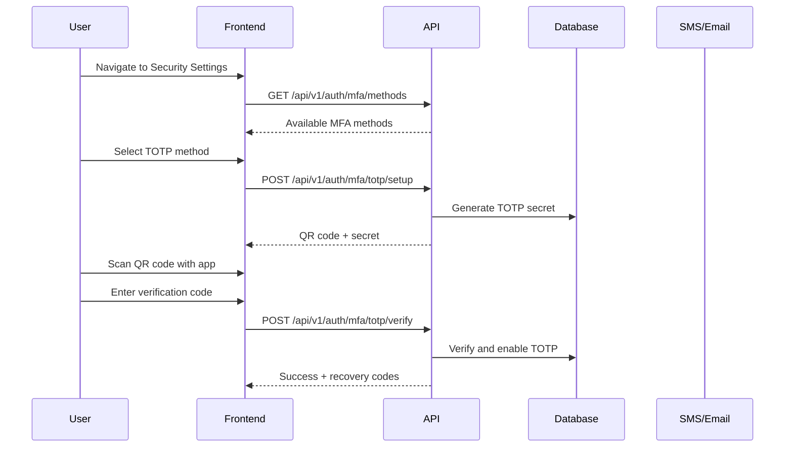
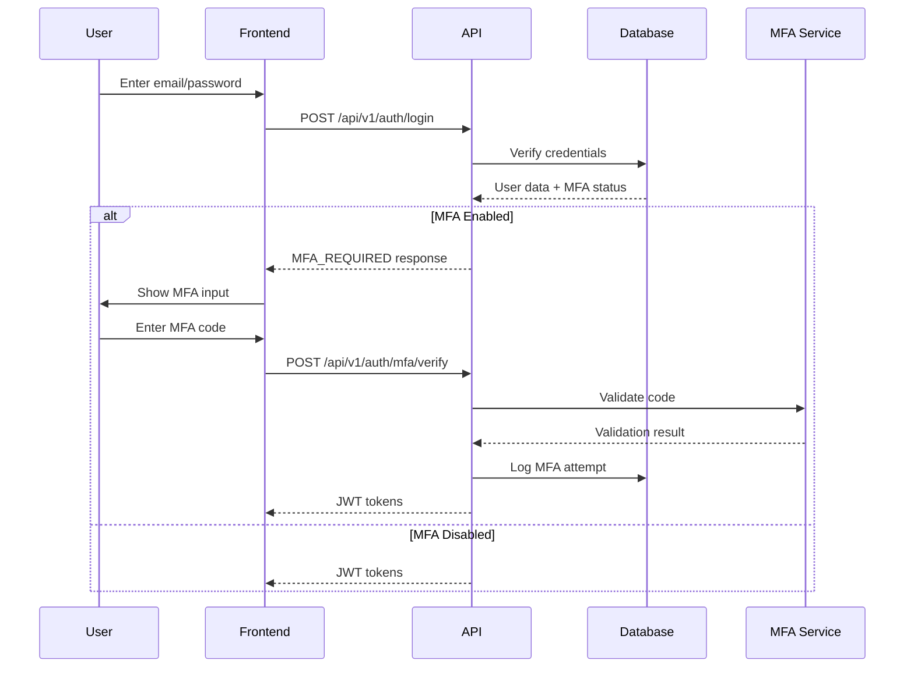

# Multi-Factor Authentication (MFA)

This document provides comprehensive information about Multi-Factor Authentication (MFA) implementation in BugRelay, including supported methods, setup procedures, and security considerations.

## Overview

Multi-Factor Authentication adds an additional layer of security to user accounts by requiring two or more verification factors:

- **Something you know** (password)
- **Something you have** (mobile device, hardware token)
- **Something you are** (biometric data)

BugRelay supports multiple MFA methods to accommodate different user preferences and security requirements.

## Supported MFA Methods

### 1. Time-based One-Time Password (TOTP)

TOTP is the most common MFA method using authenticator apps:

**Supported Apps:**
- Google Authenticator
- Microsoft Authenticator
- Authy
- 1Password
- Bitwarden

**Features:**
- 6-digit codes that change every 30 seconds
- Works offline after initial setup
- Industry-standard RFC 6238 implementation
- QR code setup for easy configuration

### 2. SMS-based Authentication

SMS codes sent to registered mobile numbers:

**Features:**
- 6-digit codes sent via SMS
- 5-minute expiration time
- Rate limiting to prevent abuse
- International number support

**Security Considerations:**
- Vulnerable to SIM swapping attacks
- Requires cellular coverage
- Not recommended for high-security accounts

### 3. Email-based Authentication

Backup codes sent to verified email addresses:

**Features:**
- 8-digit codes sent via email
- 10-minute expiration time
- Fallback option when other methods unavailable
- HTML and plain text email support

### 4. Recovery Codes

Single-use backup codes for account recovery:

**Features:**
- 10 unique 8-character codes
- One-time use only
- Downloadable and printable
- Regeneration capability

## MFA Setup Process

### Initial MFA Enrollment



### TOTP Setup Implementation

#### Backend Setup Endpoint

```go
// TOTPSetupRequest represents TOTP setup request
type TOTPSetupRequest struct {
    Method string `json:"method" binding:"required,oneof=totp sms email"`
}

// TOTPSetupResponse represents TOTP setup response
type TOTPSetupResponse struct {
    Secret    string `json:"secret"`
    QRCodeURL string `json:"qr_code_url"`
    BackupURL string `json:"backup_url"`
}

// SetupMFA initiates MFA setup for a user
func (h *AuthHandler) SetupMFA(c *gin.Context) {
    userID := c.GetString("user_id")
    
    var req TOTPSetupRequest
    if err := c.ShouldBindJSON(&req); err != nil {
        c.JSON(http.StatusBadRequest, gin.H{
            "error": gin.H{
                "code": "INVALID_REQUEST",
                "message": "Invalid request data",
            },
        })
        return
    }
    
    switch req.Method {
    case "totp":
        h.setupTOTP(c, userID)
    case "sms":
        h.setupSMS(c, userID)
    case "email":
        h.setupEmail(c, userID)
    default:
        c.JSON(http.StatusBadRequest, gin.H{
            "error": gin.H{
                "code": "UNSUPPORTED_METHOD",
                "message": "MFA method not supported",
            },
        })
    }
}

func (h *AuthHandler) setupTOTP(c *gin.Context, userID string) {
    // Generate TOTP secret
    secret := make([]byte, 20)
    if _, err := rand.Read(secret); err != nil {
        c.JSON(http.StatusInternalServerError, gin.H{
            "error": gin.H{
                "code": "SECRET_GENERATION_FAILED",
                "message": "Failed to generate TOTP secret",
            },
        })
        return
    }
    
    secretBase32 := base32.StdEncoding.EncodeToString(secret)
    
    // Get user info for QR code
    var user models.User
    if err := h.db.Where("id = ?", userID).First(&user).Error; err != nil {
        c.JSON(http.StatusNotFound, gin.H{
            "error": gin.H{
                "code": "USER_NOT_FOUND",
                "message": "User not found",
            },
        })
        return
    }
    
    // Generate QR code URL
    qrURL := fmt.Sprintf(
        "otpauth://totp/BugRelay:%s?secret=%s&issuer=BugRelay",
        url.QueryEscape(user.Email),
        secretBase32,
    )
    
    // Store temporary secret (not yet activated)
    mfaSetup := models.MFASetup{
        UserID:    uuid.MustParse(userID),
        Method:    "totp",
        Secret:    secretBase32,
        IsActive:  false,
        ExpiresAt: time.Now().Add(10 * time.Minute),
    }
    
    if err := h.db.Create(&mfaSetup).Error; err != nil {
        c.JSON(http.StatusInternalServerError, gin.H{
            "error": gin.H{
                "code": "SETUP_FAILED",
                "message": "Failed to initialize MFA setup",
            },
        })
        return
    }
    
    response := TOTPSetupResponse{
        Secret:    secretBase32,
        QRCodeURL: qrURL,
        BackupURL: fmt.Sprintf("https://chart.googleapis.com/chart?chs=200x200&chld=M|0&cht=qr&chl=%s", url.QueryEscape(qrURL)),
    }
    
    c.JSON(http.StatusOK, gin.H{
        "message": "TOTP setup initiated",
        "data":    response,
    })
}
```

#### Frontend Setup Component

```javascript
import React, { useState } from 'react';
import QRCode from 'qrcode.react';

function MFASetup() {
    const [step, setStep] = useState('select'); // select, setup, verify, complete
    const [method, setMethod] = useState('');
    const [setupData, setSetupData] = useState(null);
    const [verificationCode, setVerificationCode] = useState('');
    const [recoveryCodes, setRecoveryCodes] = useState([]);

    const initiateSetup = async (selectedMethod) => {
        try {
            const response = await fetch('/api/v1/auth/mfa/setup', {
                method: 'POST',
                headers: {
                    'Content-Type': 'application/json',
                    'Authorization': `Bearer ${accessToken}`,
                },
                body: JSON.stringify({ method: selectedMethod }),
            });

            const data = await response.json();
            
            if (data.success) {
                setMethod(selectedMethod);
                setSetupData(data.data);
                setStep('setup');
            }
        } catch (error) {
            console.error('MFA setup failed:', error);
        }
    };

    const verifySetup = async () => {
        try {
            const response = await fetch('/api/v1/auth/mfa/verify-setup', {
                method: 'POST',
                headers: {
                    'Content-Type': 'application/json',
                    'Authorization': `Bearer ${accessToken}`,
                },
                body: JSON.stringify({ 
                    method,
                    code: verificationCode 
                }),
            });

            const data = await response.json();
            
            if (data.success) {
                setRecoveryCodes(data.data.recovery_codes);
                setStep('complete');
            }
        } catch (error) {
            console.error('MFA verification failed:', error);
        }
    };

    return (
        <div className="mfa-setup">
            {step === 'select' && (
                <div>
                    <h3>Choose MFA Method</h3>
                    <button onClick={() => initiateSetup('totp')}>
                        Authenticator App (Recommended)
                    </button>
                    <button onClick={() => initiateSetup('sms')}>
                        SMS Text Message
                    </button>
                    <button onClick={() => initiateSetup('email')}>
                        Email Backup Codes
                    </button>
                </div>
            )}

            {step === 'setup' && method === 'totp' && (
                <div>
                    <h3>Setup Authenticator App</h3>
                    <p>Scan this QR code with your authenticator app:</p>
                    <QRCode value={setupData.qr_code_url} size={200} />
                    <p>Or enter this secret manually: <code>{setupData.secret}</code></p>
                    <button onClick={() => setStep('verify')}>
                        I've Added the Account
                    </button>
                </div>
            )}

            {step === 'verify' && (
                <div>
                    <h3>Verify Setup</h3>
                    <p>Enter the 6-digit code from your authenticator app:</p>
                    <input
                        type="text"
                        value={verificationCode}
                        onChange={(e) => setVerificationCode(e.target.value)}
                        maxLength={6}
                        placeholder="000000"
                    />
                    <button onClick={verifySetup}>
                        Verify and Enable MFA
                    </button>
                </div>
            )}

            {step === 'complete' && (
                <div>
                    <h3>MFA Enabled Successfully!</h3>
                    <p>Save these recovery codes in a safe place:</p>
                    <div className="recovery-codes">
                        {recoveryCodes.map((code, index) => (
                            <code key={index}>{code}</code>
                        ))}
                    </div>
                    <button onClick={() => window.print()}>
                        Print Recovery Codes
                    </button>
                </div>
            )}
        </div>
    );
}

export default MFASetup;
```

## MFA Login Process

### Enhanced Login Flow

When MFA is enabled, the login process requires an additional verification step:



### MFA Verification Implementation

#### Backend Verification

```go
// MFAVerifyRequest represents MFA verification request
type MFAVerifyRequest struct {
    Method string `json:"method" binding:"required"`
    Code   string `json:"code" binding:"required"`
    Token  string `json:"token" binding:"required"` // Temporary login token
}

// VerifyMFA verifies MFA code during login
func (h *AuthHandler) VerifyMFA(c *gin.Context) {
    var req MFAVerifyRequest
    if err := c.ShouldBindJSON(&req); err != nil {
        c.JSON(http.StatusBadRequest, gin.H{
            "error": gin.H{
                "code": "INVALID_REQUEST",
                "message": "Invalid request data",
            },
        })
        return
    }
    
    // Validate temporary login token
    claims, err := h.authService.ValidateTemporaryToken(req.Token)
    if err != nil {
        c.JSON(http.StatusUnauthorized, gin.H{
            "error": gin.H{
                "code": "INVALID_TOKEN",
                "message": "Invalid or expired login token",
            },
        })
        return
    }
    
    // Get user MFA settings
    var mfaConfig models.MFAConfig
    if err := h.db.Where("user_id = ? AND method = ? AND is_active = ?", 
        claims.UserID, req.Method, true).First(&mfaConfig).Error; err != nil {
        c.JSON(http.StatusBadRequest, gin.H{
            "error": gin.H{
                "code": "MFA_NOT_CONFIGURED",
                "message": "MFA method not configured for this user",
            },
        })
        return
    }
    
    // Verify MFA code
    valid := false
    switch req.Method {
    case "totp":
        valid = h.verifyTOTP(mfaConfig.Secret, req.Code)
    case "sms":
        valid = h.verifySMS(claims.UserID, req.Code)
    case "email":
        valid = h.verifyEmail(claims.UserID, req.Code)
    case "recovery":
        valid = h.verifyRecoveryCode(claims.UserID, req.Code)
    }
    
    if !valid {
        // Log failed attempt
        h.logMFAAttempt(claims.UserID, req.Method, false, c.ClientIP())
        
        c.JSON(http.StatusUnauthorized, gin.H{
            "error": gin.H{
                "code": "INVALID_MFA_CODE",
                "message": "Invalid MFA code",
            },
        })
        return
    }
    
    // Log successful attempt
    h.logMFAAttempt(claims.UserID, req.Method, true, c.ClientIP())
    
    // Get user data
    var user models.User
    if err := h.db.Where("id = ?", claims.UserID).First(&user).Error; err != nil {
        c.JSON(http.StatusInternalServerError, gin.H{
            "error": gin.H{
                "code": "USER_FETCH_FAILED",
                "message": "Failed to fetch user data",
            },
        })
        return
    }
    
    // Generate final JWT tokens
    accessToken, refreshToken, err := h.authService.GenerateTokens(
        user.ID.String(), user.Email, user.IsAdmin)
    if err != nil {
        c.JSON(http.StatusInternalServerError, gin.H{
            "error": gin.H{
                "code": "TOKEN_GENERATION_FAILED",
                "message": "Failed to generate tokens",
            },
        })
        return
    }
    
    response := AuthResponse{
        User: UserResponse{
            ID:          user.ID,
            Email:       user.Email,
            DisplayName: user.DisplayName,
            AvatarURL:   user.AvatarURL,
            IsAdmin:     user.IsAdmin,
            CreatedAt:   user.CreatedAt,
        },
        AccessToken:  accessToken,
        RefreshToken: refreshToken,
        ExpiresIn:    3600,
    }
    
    c.JSON(http.StatusOK, gin.H{
        "message": "MFA verification successful",
        "data":    response,
    })
}

func (h *AuthHandler) verifyTOTP(secret, code string) bool {
    // Implement TOTP verification using RFC 6238
    secretBytes, err := base32.StdEncoding.DecodeString(secret)
    if err != nil {
        return false
    }
    
    now := time.Now().Unix() / 30 // 30-second window
    
    // Check current window and ±1 window for clock skew
    for i := -1; i <= 1; i++ {
        timeWindow := now + int64(i)
        expectedCode := generateTOTP(secretBytes, timeWindow)
        if expectedCode == code {
            return true
        }
    }
    
    return false
}

func generateTOTP(secret []byte, timeWindow int64) string {
    // HMAC-SHA1 based TOTP implementation
    h := hmac.New(sha1.New, secret)
    binary.Write(h, binary.BigEndian, timeWindow)
    hash := h.Sum(nil)
    
    offset := hash[19] & 0x0f
    code := binary.BigEndian.Uint32(hash[offset:offset+4]) & 0x7fffffff
    
    return fmt.Sprintf("%06d", code%1000000)
}
```

#### Frontend MFA Login

```javascript
function MFALogin({ temporaryToken, onSuccess, onError }) {
    const [method, setMethod] = useState('totp');
    const [code, setCode] = useState('');
    const [loading, setLoading] = useState(false);

    const verifyMFA = async () => {
        setLoading(true);
        
        try {
            const response = await fetch('/api/v1/auth/mfa/verify', {
                method: 'POST',
                headers: { 'Content-Type': 'application/json' },
                body: JSON.stringify({
                    method,
                    code,
                    token: temporaryToken,
                }),
            });

            const data = await response.json();
            
            if (data.success) {
                onSuccess(data.data);
            } else {
                onError(data.error.message);
            }
        } catch (error) {
            onError('MFA verification failed');
        } finally {
            setLoading(false);
        }
    };

    return (
        <div className="mfa-login">
            <h3>Two-Factor Authentication</h3>
            
            <div className="method-selector">
                <button 
                    className={method === 'totp' ? 'active' : ''}
                    onClick={() => setMethod('totp')}
                >
                    Authenticator App
                </button>
                <button 
                    className={method === 'sms' ? 'active' : ''}
                    onClick={() => setMethod('sms')}
                >
                    SMS Code
                </button>
                <button 
                    className={method === 'recovery' ? 'active' : ''}
                    onClick={() => setMethod('recovery')}
                >
                    Recovery Code
                </button>
            </div>

            <div className="code-input">
                <input
                    type="text"
                    value={code}
                    onChange={(e) => setCode(e.target.value)}
                    placeholder={method === 'recovery' ? 'Recovery code' : '6-digit code'}
                    maxLength={method === 'recovery' ? 8 : 6}
                />
                <button 
                    onClick={verifyMFA}
                    disabled={loading || !code}
                >
                    {loading ? 'Verifying...' : 'Verify'}
                </button>
            </div>

            {method === 'sms' && (
                <button className="resend-sms">
                    Resend SMS Code
                </button>
            )}
        </div>
    );
}
```

## Database Schema

### MFA Configuration Table

```sql
CREATE TABLE mfa_configs (
    id UUID PRIMARY KEY DEFAULT uuid_generate_v4(),
    user_id UUID NOT NULL REFERENCES users(id) ON DELETE CASCADE,
    method VARCHAR(20) NOT NULL, -- 'totp', 'sms', 'email'
    secret VARCHAR(255), -- Base32 encoded secret for TOTP
    phone_number VARCHAR(20), -- For SMS method
    is_active BOOLEAN DEFAULT false,
    backup_codes TEXT[], -- Array of recovery codes
    created_at TIMESTAMP DEFAULT NOW(),
    updated_at TIMESTAMP DEFAULT NOW(),
    
    UNIQUE(user_id, method)
);

CREATE INDEX idx_mfa_configs_user_id ON mfa_configs(user_id);
CREATE INDEX idx_mfa_configs_active ON mfa_configs(user_id, is_active);
```

### MFA Attempts Log

```sql
CREATE TABLE mfa_attempts (
    id UUID PRIMARY KEY DEFAULT uuid_generate_v4(),
    user_id UUID NOT NULL REFERENCES users(id) ON DELETE CASCADE,
    method VARCHAR(20) NOT NULL,
    success BOOLEAN NOT NULL,
    ip_address INET,
    user_agent TEXT,
    attempted_at TIMESTAMP DEFAULT NOW()
);

CREATE INDEX idx_mfa_attempts_user_id ON mfa_attempts(user_id);
CREATE INDEX idx_mfa_attempts_time ON mfa_attempts(attempted_at);
```

### Temporary Login Tokens

```sql
CREATE TABLE temp_login_tokens (
    id UUID PRIMARY KEY DEFAULT uuid_generate_v4(),
    user_id UUID NOT NULL REFERENCES users(id) ON DELETE CASCADE,
    token_hash VARCHAR(255) NOT NULL,
    expires_at TIMESTAMP NOT NULL,
    created_at TIMESTAMP DEFAULT NOW()
);

CREATE INDEX idx_temp_tokens_hash ON temp_login_tokens(token_hash);
CREATE INDEX idx_temp_tokens_expires ON temp_login_tokens(expires_at);
```

## Security Considerations

### TOTP Security

- **Clock Skew Tolerance**: Accept codes from ±1 time window (30 seconds)
- **Replay Protection**: Store used codes to prevent reuse
- **Secret Storage**: Encrypt TOTP secrets in database
- **QR Code Security**: Generate QR codes server-side, expire setup sessions

### SMS Security

- **Rate Limiting**: Limit SMS requests per user per hour
- **Number Verification**: Verify phone numbers before enabling SMS MFA
- **International Support**: Support international phone number formats
- **Carrier Reliability**: Implement fallback methods for SMS delivery issues

### Recovery Codes

- **One-Time Use**: Invalidate codes after use
- **Secure Generation**: Use cryptographically secure random generation
- **Storage**: Hash recovery codes in database
- **Regeneration**: Allow users to regenerate codes when needed

### General Security

- **Brute Force Protection**: Rate limit MFA verification attempts
- **Audit Logging**: Log all MFA setup and verification attempts
- **Session Management**: Invalidate sessions on MFA changes
- **Backup Methods**: Require multiple MFA methods for critical accounts

## Configuration

### Environment Variables

```bash
# MFA Configuration
MFA_TOTP_ISSUER=BugRelay
MFA_TOTP_WINDOW=1
MFA_SMS_PROVIDER=twilio
MFA_SMS_RATE_LIMIT=5

# SMS Provider (Twilio)
TWILIO_ACCOUNT_SID=your-account-sid
TWILIO_AUTH_TOKEN=your-auth-token
TWILIO_PHONE_NUMBER=+1234567890

# Email Provider
SMTP_HOST=smtp.example.com
SMTP_PORT=587
SMTP_USERNAME=your-username
SMTP_PASSWORD=your-password
```

### Feature Flags

```go
type MFAConfig struct {
    TOTPEnabled     bool `json:"totp_enabled"`
    SMSEnabled      bool `json:"sms_enabled"`
    EmailEnabled    bool `json:"email_enabled"`
    RecoveryEnabled bool `json:"recovery_enabled"`
    RequiredForAdmin bool `json:"required_for_admin"`
}
```

## API Endpoints

### MFA Management

| Method | Endpoint | Description |
|--------|----------|-------------|
| GET | `/api/v1/auth/mfa/methods` | List available MFA methods |
| POST | `/api/v1/auth/mfa/setup` | Initiate MFA setup |
| POST | `/api/v1/auth/mfa/verify-setup` | Verify and activate MFA |
| POST | `/api/v1/auth/mfa/verify` | Verify MFA during login |
| DELETE | `/api/v1/auth/mfa/{method}` | Disable MFA method |
| POST | `/api/v1/auth/mfa/recovery/regenerate` | Regenerate recovery codes |

### MFA Status

```json
{
  "success": true,
  "data": {
    "enabled": true,
    "methods": [
      {
        "type": "totp",
        "enabled": true,
        "configured_at": "2024-01-15T10:30:00Z"
      },
      {
        "type": "sms",
        "enabled": false,
        "phone_number": "+1***-***-1234"
      }
    ],
    "recovery_codes_remaining": 8
  }
}
```

## Testing MFA Implementation

### Unit Tests

```go
func TestTOTPVerification(t *testing.T) {
    secret := "JBSWY3DPEHPK3PXP"
    
    // Generate valid TOTP code
    code := generateTOTP(base32.StdEncoding.DecodeString(secret), time.Now().Unix()/30)
    
    // Test verification
    valid := verifyTOTP(secret, code)
    assert.True(t, valid)
    
    // Test invalid code
    invalid := verifyTOTP(secret, "000000")
    assert.False(t, invalid)
}

func TestMFASetup(t *testing.T) {
    // Test TOTP setup
    response := setupTOTP(testUserID)
    assert.NotEmpty(t, response.Secret)
    assert.Contains(t, response.QRCodeURL, "otpauth://totp/")
    
    // Test verification
    code := generateTOTP(response.Secret, time.Now().Unix()/30)
    success := verifyMFASetup(testUserID, "totp", code)
    assert.True(t, success)
}
```

### Integration Tests

```javascript
describe('MFA Integration', () => {
    test('should setup TOTP successfully', async () => {
        const response = await request(app)
            .post('/api/v1/auth/mfa/setup')
            .set('Authorization', `Bearer ${accessToken}`)
            .send({ method: 'totp' });
        
        expect(response.status).toBe(200);
        expect(response.body.data.secret).toBeDefined();
        expect(response.body.data.qr_code_url).toContain('otpauth://');
    });
    
    test('should require MFA for login', async () => {
        // Enable MFA for test user
        await enableMFA(testUser.id, 'totp');
        
        const loginResponse = await request(app)
            .post('/api/v1/auth/login')
            .send({
                email: testUser.email,
                password: 'password123'
            });
        
        expect(loginResponse.status).toBe(200);
        expect(loginResponse.body.mfa_required).toBe(true);
        expect(loginResponse.body.temp_token).toBeDefined();
    });
});
```

## Troubleshooting

### Common Issues

#### TOTP Code Not Working
- **Clock Skew**: Ensure device time is synchronized
- **Code Reuse**: TOTP codes can only be used once
- **Time Window**: Codes are valid for 30-second windows

#### SMS Not Received
- **Rate Limiting**: Check if SMS rate limit exceeded
- **Phone Number**: Verify phone number format and country code
- **Carrier Issues**: Some carriers may block automated SMS

#### Recovery Code Issues
- **Case Sensitivity**: Recovery codes are case-insensitive
- **Spaces**: Ignore spaces and hyphens in recovery codes
- **Expiration**: Recovery codes don't expire but are single-use

### Error Codes

| Code | Description | Solution |
|------|-------------|----------|
| `MFA_NOT_CONFIGURED` | MFA method not set up | Complete MFA setup first |
| `INVALID_MFA_CODE` | Wrong verification code | Check code and try again |
| `MFA_RATE_LIMITED` | Too many attempts | Wait before retrying |
| `TOTP_CLOCK_SKEW` | Time synchronization issue | Sync device clock |
| `SMS_DELIVERY_FAILED` | SMS sending failed | Try alternative method |

## Best Practices

### For Users
- Use authenticator apps over SMS when possible
- Store recovery codes in a secure location
- Enable multiple MFA methods for redundancy
- Regularly review MFA settings and logs

### For Administrators
- Require MFA for admin accounts
- Monitor MFA bypass attempts
- Implement progressive security measures
- Provide user education on MFA benefits

### For Developers
- Implement proper rate limiting
- Log all MFA events for security monitoring
- Use secure random number generation
- Encrypt sensitive MFA data at rest

## Related Documentation

- [JWT Implementation](./jwt)
- [Session Management](./sessions)
- [Security Considerations](./security)
- [OAuth Integration](./oauth)
- [Authentication Flows](./flows)