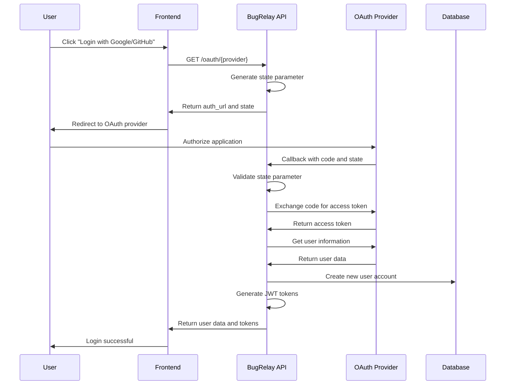
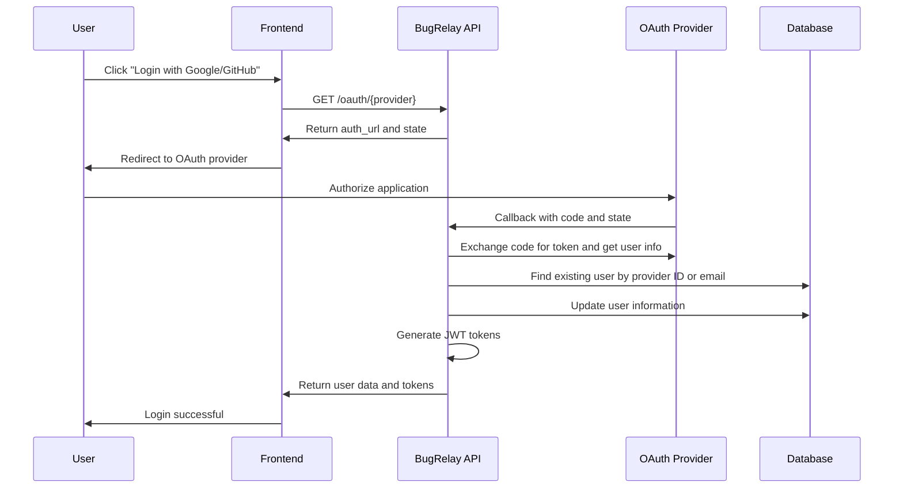
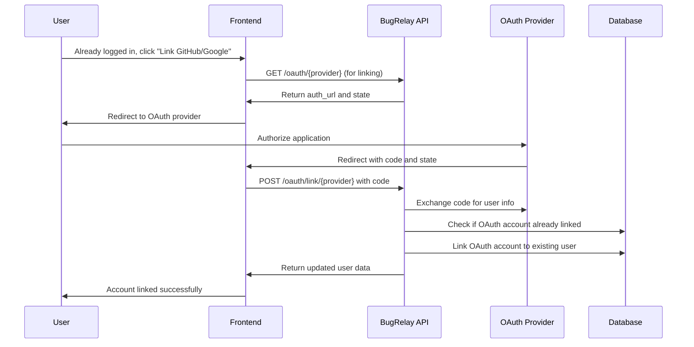

# OAuth Integration Guide

This document provides comprehensive guidance on integrating with BugRelay's OAuth authentication system, including setup instructions for Google and GitHub OAuth providers, callback handling, and account linking processes.

## Overview

BugRelay supports OAuth 2.0 authentication with the following providers:
- **Google OAuth 2.0**: Using Google's OpenID Connect
- **GitHub OAuth**: Using GitHub's OAuth 2.0 implementation

OAuth authentication allows users to sign in using their existing accounts from these providers, eliminating the need to create and remember additional passwords.

## Supported OAuth Providers

### Google OAuth 2.0

#### Configuration Requirements
- **Client ID**: Google OAuth 2.0 client ID
- **Client Secret**: Google OAuth 2.0 client secret
- **Redirect URI**: `{base_url}/api/v1/oauth/callback/google`
- **Scopes**: `openid`, `profile`, `email`

#### User Information Retrieved
- User ID (Google's unique identifier)
- Email address
- Display name
- Profile picture URL
- Email verification status

### GitHub OAuth

#### Configuration Requirements
- **Client ID**: GitHub OAuth application client ID
- **Client Secret**: GitHub OAuth application client secret
- **Redirect URI**: `{base_url}/api/v1/oauth/callback/github`
- **Scopes**: `user:email`

#### User Information Retrieved
- User ID (GitHub's unique identifier)
- Username (used as fallback for display name)
- Display name
- Email address (from primary verified email)
- Avatar URL

## OAuth Setup Guide

### 1. Google OAuth Setup

#### Step 1: Create Google Cloud Project
1. Go to [Google Cloud Console](https://console.cloud.google.com/)
2. Create a new project or select existing project
3. Enable the Google+ API and Google Identity API

#### Step 2: Configure OAuth Consent Screen
1. Navigate to "APIs & Services" > "OAuth consent screen"
2. Choose "External" user type
3. Fill in application information:
   - **App name**: BugRelay
   - **User support email**: Your support email
   - **Developer contact information**: Your contact email
4. Add scopes: `openid`, `profile`, `email`
5. Add test users if in development mode

#### Step 3: Create OAuth Credentials
1. Navigate to "APIs & Services" > "Credentials"
2. Click "Create Credentials" > "OAuth 2.0 Client IDs"
3. Choose "Web application"
4. Configure:
   - **Name**: BugRelay OAuth Client
   - **Authorized redirect URIs**: 
     - Development: `http://localhost:8080/api/v1/oauth/callback/google`
     - Production: `https://yourdomain.com/api/v1/oauth/callback/google`
5. Save the Client ID and Client Secret

#### Step 4: Environment Configuration
```bash
# Add to your .env file
GOOGLE_CLIENT_ID=your_google_client_id
GOOGLE_CLIENT_SECRET=your_google_client_secret
OAUTH_REDIRECT_URL=http://localhost:8080/api/v1/oauth/callback
```

### 2. GitHub OAuth Setup

#### Step 1: Create GitHub OAuth App
1. Go to GitHub Settings > Developer settings > OAuth Apps
2. Click "New OAuth App"
3. Fill in application details:
   - **Application name**: BugRelay
   - **Homepage URL**: Your application URL
   - **Authorization callback URL**: 
     - Development: `http://localhost:8080/api/v1/oauth/callback/github`
     - Production: `https://yourdomain.com/api/v1/oauth/callback/github`
4. Register the application

#### Step 2: Get Credentials
1. Note the Client ID from the app page
2. Generate a new Client Secret
3. Store both securely

#### Step 3: Environment Configuration
```bash
# Add to your .env file
GITHUB_CLIENT_ID=your_github_client_id
GITHUB_CLIENT_SECRET=your_github_client_secret
OAUTH_REDIRECT_URL=http://localhost:8080/api/v1/oauth/callback
```

## OAuth Authentication Flow

### 1. Initiate OAuth Flow

#### Endpoint
```
GET /api/v1/oauth/{provider}
```

#### Parameters
- `provider`: Either `google` or `github`

#### Process
1. Generate secure state parameter for CSRF protection
2. Store state in HTTP-only cookie (10 minutes expiration)
3. Generate authorization URL with required scopes
4. Return authorization URL to client

#### Response (200 OK)
```json
{
  "auth_url": "https://accounts.google.com/oauth/authorize?client_id=...",
  "state": "secure-random-state-string"
}
```

#### Example Usage
```javascript
// Initiate Google OAuth
const response = await fetch('/api/v1/oauth/google');
const data = await response.json();

// Redirect user to OAuth provider
window.location.href = data.auth_url;
```

### 2. OAuth Callback Handling

#### Endpoint
```
GET /api/v1/oauth/callback/{provider}
```

#### Query Parameters
- `code`: Authorization code from OAuth provider
- `state`: State parameter for CSRF protection
- `error`: Error code (if authorization failed)

#### Process
1. Validate state parameter against stored cookie
2. Exchange authorization code for access token
3. Retrieve user information from OAuth provider
4. Find or create user account
5. Generate JWT tokens
6. Return authentication response

#### Response (200 OK)
```json
{
  "message": "OAuth authentication successful",
  "data": {
    "user": {
      "id": "550e8400-e29b-41d4-a716-446655440000",
      "email": "user@example.com",
      "display_name": "John Doe",
      "avatar_url": "https://avatars.githubusercontent.com/u/123456",
      "is_admin": false,
      "created_at": "2024-01-15T10:30:00Z"
    },
    "access_token": "eyJhbGciOiJIUzI1NiIsInR5cCI6IkpXVCJ9...",
    "refresh_token": "eyJhbGciOiJIUzI1NiIsInR5cCI6IkpXVCJ9...",
    "expires_in": 3600
  }
}
```

### 3. Account Linking

Users can link OAuth accounts to existing email/password accounts.

#### Endpoint
```
POST /api/v1/oauth/link/{provider}
```

#### Headers
```
Authorization: Bearer {access_token}
```

#### Request Body
```json
{
  "code": "authorization_code_from_oauth",
  "state": "state_parameter"
}
```

#### Process
1. Authenticate existing user via JWT token
2. Exchange OAuth code for user information
3. Verify OAuth account isn't already linked to another user
4. Link OAuth provider to existing account
5. Update user profile with OAuth information

#### Response (200 OK)
```json
{
  "message": "OAuth account linked successfully",
  "data": {
    "id": "550e8400-e29b-41d4-a716-446655440000",
    "email": "user@example.com",
    "display_name": "John Doe",
    "avatar_url": "https://avatars.githubusercontent.com/u/123456",
    "is_admin": false,
    "created_at": "2024-01-15T10:30:00Z"
  }
}
```

## OAuth Flow Diagrams

### 1. New User Registration via OAuth



### 2. Existing User Login via OAuth



### 3. Account Linking Flow



## User Account Management

### 1. Account Creation Logic

When a user authenticates via OAuth, the system follows this logic:

1. **Check by OAuth Provider ID**: Look for existing user with same provider and provider ID
2. **Check by Email**: If not found, look for user with same email address
3. **Account Linking**: If email exists but different auth provider, link accounts
4. **New Account**: If no existing account found, create new user

### 2. User Data Mapping

#### Google OAuth to User Model
```go
user := models.User{
    Email:           strings.ToLower(googleUser.Email),
    DisplayName:     googleUser.Name,
    AuthProvider:    "google",
    AuthProviderID:  &googleUser.ID,
    IsEmailVerified: googleUser.VerifiedEmail,
    AvatarURL:       &googleUser.Picture,
    IsAdmin:         false,
    LastActiveAt:    time.Now(),
}
```

#### GitHub OAuth to User Model
```go
user := models.User{
    Email:           strings.ToLower(githubUser.Email),
    DisplayName:     githubUser.Name, // Falls back to login if empty
    AuthProvider:    "github",
    AuthProviderID:  &githubUser.ID,
    IsEmailVerified: true, // GitHub emails are considered verified
    AvatarURL:       &githubUser.AvatarURL,
    IsAdmin:         false,
    LastActiveAt:    time.Now(),
}
```

### 3. Email Handling

#### Google OAuth
- Email is directly available in user info response
- Verification status is provided by Google

#### GitHub OAuth
- Primary email might not be in user endpoint
- Separate API call to `/user/emails` endpoint
- Finds primary verified email address
- Falls back to first verified email if no primary

## Security Considerations

### 1. State Parameter Validation
- Cryptographically secure random state generation
- State stored in HTTP-only cookie with 10-minute expiration
- Strict validation prevents CSRF attacks

### 2. Token Security
- OAuth access tokens are not stored
- Only used temporarily to fetch user information
- JWT tokens generated using internal secret key

### 3. Account Linking Security
- Prevents linking OAuth account already associated with another user
- Requires existing authentication to link accounts
- Validates OAuth provider response before linking

### 4. Error Handling
- Generic error messages to prevent information disclosure
- Detailed logging for debugging (server-side only)
- Graceful handling of OAuth provider errors

## Error Handling

### Common OAuth Errors

#### Client Errors (4xx)
```json
{
  "error": {
    "code": "MISSING_PROVIDER",
    "message": "OAuth provider is required",
    "timestamp": "2024-01-15T10:30:00Z"
  }
}
```

#### OAuth Provider Errors
```json
{
  "error": {
    "code": "TOKEN_EXCHANGE_FAILED",
    "message": "Failed to exchange authorization code for token",
    "timestamp": "2024-01-15T10:30:00Z"
  }
}
```

#### Account Linking Errors
```json
{
  "error": {
    "code": "OAUTH_ACCOUNT_LINKED",
    "message": "This OAuth account is already linked to another user",
    "timestamp": "2024-01-15T10:30:00Z"
  }
}
```

### Error Codes Reference
- `MISSING_PROVIDER`: OAuth provider not specified
- `INVALID_PROVIDER`: Unsupported OAuth provider
- `MISSING_CODE`: Authorization code missing from callback
- `MISSING_STATE`: State parameter missing
- `INVALID_STATE`: State parameter validation failed
- `TOKEN_EXCHANGE_FAILED`: Failed to exchange code for token
- `USER_INFO_FAILED`: Failed to retrieve user information
- `USER_CREATION_FAILED`: Failed to create or update user
- `OAUTH_ACCOUNT_LINKED`: OAuth account already linked to different user

## Integration Examples

### 1. Frontend OAuth Integration (React)

```javascript
import React, { useState, useEffect } from 'react';

const OAuthLogin = () => {
  const [loading, setLoading] = useState(false);

  const handleOAuthLogin = async (provider) => {
    setLoading(true);
    try {
      // Get OAuth URL
      const response = await fetch(`/api/v1/oauth/${provider}`);
      const data = await response.json();
      
      // Redirect to OAuth provider
      window.location.href = data.auth_url;
    } catch (error) {
      console.error('OAuth initiation failed:', error);
      setLoading(false);
    }
  };

  // Handle OAuth callback
  useEffect(() => {
    const urlParams = new URLSearchParams(window.location.search);
    const code = urlParams.get('code');
    const state = urlParams.get('state');
    const error = urlParams.get('error');

    if (error) {
      console.error('OAuth error:', error);
      return;
    }

    if (code && state) {
      // OAuth callback handled by backend
      // Backend will process and redirect appropriately
    }
  }, []);

  return (
    <div>
      <button 
        onClick={() => handleOAuthLogin('google')}
        disabled={loading}
      >
        Login with Google
      </button>
      <button 
        onClick={() => handleOAuthLogin('github')}
        disabled={loading}
      >
        Login with GitHub
      </button>
    </div>
  );
};

export default OAuthLogin;
```

### 2. Account Linking Example

```javascript
const linkOAuthAccount = async (provider) => {
  try {
    // Get OAuth URL for linking
    const response = await fetch(`/api/v1/oauth/${provider}`);
    const data = await response.json();
    
    // Open OAuth in popup window
    const popup = window.open(
      data.auth_url,
      'oauth-link',
      'width=500,height=600'
    );
    
    // Listen for popup completion
    const checkClosed = setInterval(() => {
      if (popup.closed) {
        clearInterval(checkClosed);
        // Handle completion (check for success/error)
        window.location.reload();
      }
    }, 1000);
  } catch (error) {
    console.error('Account linking failed:', error);
  }
};
```

### 3. Backend OAuth Configuration

```go
// OAuth service configuration
oauthConfig := auth.OAuthConfig{
    GoogleClientID:     os.Getenv("GOOGLE_CLIENT_ID"),
    GoogleClientSecret: os.Getenv("GOOGLE_CLIENT_SECRET"),
    GitHubClientID:     os.Getenv("GITHUB_CLIENT_ID"),
    GitHubClientSecret: os.Getenv("GITHUB_CLIENT_SECRET"),
    RedirectURL:        os.Getenv("OAUTH_REDIRECT_URL"),
}

oauthService := auth.NewOAuthService(oauthConfig)
```

## Testing OAuth Integration

### 1. Development Testing
- Use localhost redirect URIs for local testing
- Test with personal Google/GitHub accounts
- Verify state parameter validation
- Test account creation and linking flows

### 2. Production Considerations
- Use HTTPS redirect URIs in production
- Configure proper domain verification
- Monitor OAuth provider rate limits
- Implement proper error logging

### 3. Test Cases
- New user registration via OAuth
- Existing user login via OAuth
- Account linking to existing email account
- Error handling for invalid states
- Error handling for OAuth provider failures
- Token refresh after OAuth login

## Troubleshooting

### Common Issues

#### 1. Invalid Redirect URI
**Problem**: OAuth provider returns "redirect_uri_mismatch" error
**Solution**: Ensure redirect URI in OAuth app configuration exactly matches the one used in requests

#### 2. State Parameter Mismatch
**Problem**: "Invalid state parameter" error
**Solution**: Check cookie settings and ensure state is properly stored and retrieved

#### 3. Email Not Available
**Problem**: OAuth provider doesn't return email address
**Solution**: Verify required scopes are requested and user has granted email permission

#### 4. Account Already Exists
**Problem**: User tries to create account with OAuth but email already exists
**Solution**: Implement account linking flow or provide clear error message

### Debug Information

Enable debug logging to troubleshoot OAuth issues:

```go
// Log OAuth responses (development only)
if os.Getenv("DEBUG_OAUTH") == "true" {
    log.Printf("OAuth user info: %+v", userInfo)
}
```

## Best Practices

### 1. Security
- Always validate state parameters
- Use HTTPS in production
- Don't log sensitive OAuth tokens
- Implement proper CSRF protection

### 2. User Experience
- Provide clear error messages
- Handle OAuth cancellation gracefully
- Show loading states during OAuth flow
- Offer account linking options

### 3. Error Handling
- Log detailed errors server-side
- Return generic error messages to clients
- Implement retry mechanisms for transient failures
- Monitor OAuth provider status pages

### 4. Performance
- Cache OAuth provider configurations
- Implement connection pooling for HTTP requests
- Set appropriate timeouts for OAuth requests
- Monitor OAuth flow completion rates