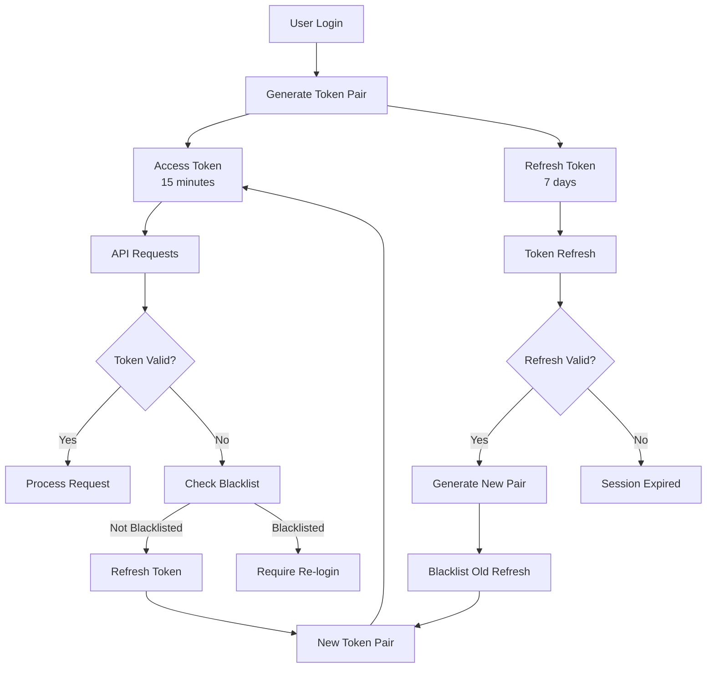

# Session Management

This document provides comprehensive information about session management in BugRelay, including session lifecycle, security considerations, and implementation details.

## Overview

BugRelay implements stateless session management using JWT tokens with sophisticated blacklisting capabilities. The system provides:

- **Stateless Authentication**: JWT-based sessions without server-side storage
- **Token Blacklisting**: Revocation support via Redis and database
- **Session Tracking**: Comprehensive logging and monitoring
- **Multi-Device Support**: Independent session management per device
- **Security Controls**: Automatic session expiration and revocation

## Session Architecture

### Token-Based Sessions

BugRelay uses a dual-token system for session management:



### Session Components

#### 1. Access Tokens
- **Purpose**: Authenticate API requests
- **Lifetime**: 15 minutes (configurable)
- **Storage**: Client memory/sessionStorage
- **Validation**: Signature + expiration + blacklist check

#### 2. Refresh Tokens
- **Purpose**: Generate new access tokens
- **Lifetime**: 7 days (configurable)
- **Storage**: HTTP-only cookies (recommended)
- **Rotation**: New refresh token issued on each use

#### 3. Blacklist System
- **Redis Layer**: Fast lookup for active sessions
- **Database Layer**: Persistent storage for audit
- **Cleanup**: Automatic removal of expired entries

## Session Lifecycle

### Session Creation

```go
// Session creation during login
func (h *AuthHandler) createSession(user *models.User) (*SessionResponse, error) {
    // Generate token pair
    accessToken, refreshToken, err := h.authService.GenerateTokens(
        user.ID.String(), 
        user.Email, 
        user.IsAdmin,
    )
    if err != nil {
        return nil, fmt.Errorf("failed to generate tokens: %w", err)
    }
    
    // Create session record
    session := &models.UserSession{
        UserID:       user.ID,
        AccessToken:  accessToken,
        RefreshToken: refreshToken,
        IPAddress:    h.getClientIP(),
        UserAgent:    h.getUserAgent(),
        CreatedAt:    time.Now(),
        LastUsedAt:   time.Now(),
        IsActive:     true,
    }
    
    if err := h.db.Create(session).Error; err != nil {
        return nil, fmt.Errorf("failed to create session: %w", err)
    }
    
    return &SessionResponse{
        SessionID:    session.ID.String(),
        AccessToken:  accessToken,
        RefreshToken: refreshToken,
        ExpiresIn:    900, // 15 minutes
        User:         h.mapUserResponse(user),
    }, nil
}
```

### Session Validation

```go
// Session validation middleware
func (h *AuthHandler) ValidateSession() gin.HandlerFunc {
    return func(c *gin.Context) {
        // Extract token from header
        authHeader := c.GetHeader("Authorization")
        if authHeader == "" {
            c.JSON(http.StatusUnauthorized, gin.H{
                "error": gin.H{
                    "code": "MISSING_TOKEN",
                    "message": "Authorization token required",
                },
            })
            c.Abort()
            return
        }
        
        parts := strings.SplitN(authHeader, " ", 2)
        if len(parts) != 2 || parts[0] != "Bearer" {
            c.JSON(http.StatusUnauthorized, gin.H{
                "error": gin.H{
                    "code": "INVALID_TOKEN_FORMAT",
                    "message": "Invalid authorization header format",
                },
            })
            c.Abort()
            return
        }
        
        token := parts[1]
        
        // Validate access token
        claims, err := h.authService.ValidateAccessToken(token)
        if err != nil {
            c.JSON(http.StatusUnauthorized, gin.H{
                "error": gin.H{
                    "code": "INVALID_TOKEN",
                    "message": "Invalid or expired token",
                },
            })
            c.Abort()
            return
        }
        
        // Update session last used time
        h.updateSessionActivity(claims.UserID, c.ClientIP())
        
        // Set user context
        c.Set("user_id", claims.UserID)
        c.Set("user_email", claims.Email)
        c.Set("is_admin", claims.IsAdmin)
        
        c.Next()
    }
}
```

### Session Refresh

```go
// Token refresh implementation
func (h *AuthHandler) RefreshSession(c *gin.Context) {
    var req RefreshTokenRequest
    if err := c.ShouldBindJSON(&req); err != nil {
        c.JSON(http.StatusBadRequest, gin.H{
            "error": gin.H{
                "code": "INVALID_REQUEST",
                "message": "Invalid request data",
            },
        })
        return
    }
    
    // Validate refresh token
    claims, err := h.authService.ValidateRefreshToken(req.RefreshToken)
    if err != nil {
        c.JSON(http.StatusUnauthorized, gin.H{
            "error": gin.H{
                "code": "INVALID_REFRESH_TOKEN",
                "message": "Invalid or expired refresh token",
            },
        })
        return
    }
    
    // Check if refresh token is blacklisted
    isBlacklisted, err := h.authService.IsTokenBlacklisted(claims.ID)
    if err != nil || isBlacklisted {
        c.JSON(http.StatusUnauthorized, gin.H{
            "error": gin.H{
                "code": "TOKEN_REVOKED",
                "message": "Refresh token has been revoked",
            },
        })
        return
    }
    
    // Blacklist old refresh token
    err = h.authService.BlacklistToken(req.RefreshToken)
    if err != nil {
        c.JSON(http.StatusInternalServerError, gin.H{
            "error": gin.H{
                "code": "BLACKLIST_FAILED",
                "message": "Failed to revoke old token",
            },
        })
        return
    }
    
    // Generate new token pair
    accessToken, refreshToken, err := h.authService.GenerateTokens(
        claims.UserID, 
        claims.Email, 
        claims.IsAdmin,
    )
    if err != nil {
        c.JSON(http.StatusInternalServerError, gin.H{
            "error": gin.H{
                "code": "TOKEN_GENERATION_FAILED",
                "message": "Failed to generate new tokens",
            },
        })
        return
    }
    
    // Update session record
    h.updateSessionTokens(claims.UserID, accessToken, refreshToken)
    
    c.JSON(http.StatusOK, gin.H{
        "message": "Session refreshed successfully",
        "data": gin.H{
            "access_token":  accessToken,
            "refresh_token": refreshToken,
            "expires_in":    900,
        },
    })
}
```

### Session Termination

```go
// Session logout implementation
func (h *AuthHandler) TerminateSession(c *gin.Context) {
    userID := c.GetString("user_id")
    
    // Get token from header
    authHeader := c.GetHeader("Authorization")
    token := strings.TrimPrefix(authHeader, "Bearer ")
    
    // Blacklist current token
    err := h.authService.RevokeToken(token)
    if err != nil {
        c.JSON(http.StatusInternalServerError, gin.H{
            "error": gin.H{
                "code": "LOGOUT_FAILED",
                "message": "Failed to terminate session",
            },
        })
        return
    }
    
    // Mark session as inactive
    h.deactivateSession(userID, token)
    
    // Log session termination
    h.logSessionEvent(userID, "session_terminated", c.ClientIP())
    
    c.JSON(http.StatusOK, gin.H{
        "message": "Session terminated successfully",
    })
}

// Terminate all user sessions
func (h *AuthHandler) TerminateAllSessions(c *gin.Context) {
    userID := c.GetString("user_id")
    
    // Revoke all user tokens
    err := h.authService.RevokeAllUserTokens(userID)
    if err != nil {
        c.JSON(http.StatusInternalServerError, gin.H{
            "error": gin.H{
                "code": "LOGOUT_ALL_FAILED",
                "message": "Failed to terminate all sessions",
            },
        })
        return
    }
    
    // Deactivate all user sessions
    h.deactivateAllUserSessions(userID)
    
    // Log mass session termination
    h.logSessionEvent(userID, "all_sessions_terminated", c.ClientIP())
    
    c.JSON(http.StatusOK, gin.H{
        "message": "All sessions terminated successfully",
    })
}
```

## Session Storage

### Database Schema

```sql
-- User sessions table
CREATE TABLE user_sessions (
    id UUID PRIMARY KEY DEFAULT uuid_generate_v4(),
    user_id UUID NOT NULL REFERENCES users(id) ON DELETE CASCADE,
    session_token VARCHAR(255) NOT NULL, -- Hashed session identifier
    ip_address INET,
    user_agent TEXT,
    location VARCHAR(255), -- Derived from IP
    device_type VARCHAR(50), -- mobile, desktop, tablet
    browser VARCHAR(100),
    os VARCHAR(100),
    is_active BOOLEAN DEFAULT true,
    created_at TIMESTAMP DEFAULT NOW(),
    last_used_at TIMESTAMP DEFAULT NOW(),
    expires_at TIMESTAMP NOT NULL,
    
    INDEX idx_user_sessions_user_id (user_id),
    INDEX idx_user_sessions_active (user_id, is_active),
    INDEX idx_user_sessions_expires (expires_at)
);

-- Session events log
CREATE TABLE session_events (
    id UUID PRIMARY KEY DEFAULT uuid_generate_v4(),
    user_id UUID NOT NULL REFERENCES users(id) ON DELETE CASCADE,
    session_id UUID REFERENCES user_sessions(id) ON DELETE SET NULL,
    event_type VARCHAR(50) NOT NULL, -- login, logout, refresh, expired
    ip_address INET,
    user_agent TEXT,
    success BOOLEAN DEFAULT true,
    error_code VARCHAR(50),
    metadata JSONB,
    created_at TIMESTAMP DEFAULT NOW(),
    
    INDEX idx_session_events_user_id (user_id),
    INDEX idx_session_events_type (event_type),
    INDEX idx_session_events_time (created_at)
);
```

### Redis Session Cache

```go
// Redis session caching
type SessionCache struct {
    redis *redis.Client
}

func (sc *SessionCache) StoreSession(ctx context.Context, sessionID string, data *SessionData) error {
    key := fmt.Sprintf("session:%s", sessionID)
    
    // Serialize session data
    jsonData, err := json.Marshal(data)
    if err != nil {
        return fmt.Errorf("failed to marshal session data: %w", err)
    }
    
    // Store with TTL
    err = sc.redis.Set(ctx, key, jsonData, data.ExpiresIn).Err()
    if err != nil {
        return fmt.Errorf("failed to store session in Redis: %w", err)
    }
    
    return nil
}

func (sc *SessionCache) GetSession(ctx context.Context, sessionID string) (*SessionData, error) {
    key := fmt.Sprintf("session:%s", sessionID)
    
    // Get from Redis
    jsonData, err := sc.redis.Get(ctx, key).Result()
    if err == redis.Nil {
        return nil, ErrSessionNotFound
    }
    if err != nil {
        return nil, fmt.Errorf("failed to get session from Redis: %w", err)
    }
    
    // Deserialize session data
    var data SessionData
    err = json.Unmarshal([]byte(jsonData), &data)
    if err != nil {
        return nil, fmt.Errorf("failed to unmarshal session data: %w", err)
    }
    
    return &data, nil
}

func (sc *SessionCache) DeleteSession(ctx context.Context, sessionID string) error {
    key := fmt.Sprintf("session:%s", sessionID)
    return sc.redis.Del(ctx, key).Err()
}
```

## Session Security

### Security Features

#### 1. Token Rotation
```go
// Refresh token rotation
func (s *Service) RotateRefreshToken(oldToken string) (string, error) {
    // Validate old token
    claims, err := s.jwtService.ValidateToken(oldToken)
    if err != nil {
        return "", err
    }
    
    // Blacklist old token immediately
    err = s.blacklistService.BlacklistToken(
        context.Background(), 
        claims.ID, 
        claims.UserID, 
        claims.ExpiresAt.Time,
    )
    if err != nil {
        return "", fmt.Errorf("failed to blacklist old token: %w", err)
    }
    
    // Generate new refresh token
    newToken, err := s.jwtService.generateToken(
        claims.UserID, 
        claims.Email, 
        claims.IsAdmin, 
        "refresh", 
        s.jwtService.refreshTokenTTL,
    )
    if err != nil {
        return "", fmt.Errorf("failed to generate new token: %w", err)
    }
    
    return newToken, nil
}
```

#### 2. Session Fingerprinting
```go
// Session fingerprinting for security
type SessionFingerprint struct {
    IPAddress string `json:"ip_address"`
    UserAgent string `json:"user_agent"`
    Browser   string `json:"browser"`
    OS        string `json:"os"`
    Language  string `json:"language"`
    Timezone  string `json:"timezone"`
}

func (h *AuthHandler) generateFingerprint(c *gin.Context) *SessionFingerprint {
    userAgent := c.GetHeader("User-Agent")
    
    return &SessionFingerprint{
        IPAddress: c.ClientIP(),
        UserAgent: userAgent,
        Browser:   h.parseBrowser(userAgent),
        OS:        h.parseOS(userAgent),
        Language:  c.GetHeader("Accept-Language"),
        Timezone:  c.GetHeader("X-Timezone"),
    }
}

func (h *AuthHandler) validateFingerprint(sessionID string, current *SessionFingerprint) bool {
    stored, err := h.getStoredFingerprint(sessionID)
    if err != nil {
        return false
    }
    
    // Allow IP changes but flag suspicious changes
    if stored.UserAgent != current.UserAgent {
        h.logSecurityEvent("fingerprint_mismatch", sessionID, current)
        return false
    }
    
    return true
}
```

#### 3. Concurrent Session Limits
```go
// Concurrent session management
func (h *AuthHandler) enforceConcurrentSessionLimit(userID string) error {
    const maxSessions = 5 // Configurable limit
    
    // Count active sessions
    var count int64
    err := h.db.Model(&models.UserSession{}).
        Where("user_id = ? AND is_active = ? AND expires_at > NOW()", userID, true).
        Count(&count).Error
    if err != nil {
        return fmt.Errorf("failed to count sessions: %w", err)
    }
    
    if count >= maxSessions {
        // Terminate oldest session
        var oldestSession models.UserSession
        err = h.db.Where("user_id = ? AND is_active = ?", userID, true).
            Order("last_used_at ASC").
            First(&oldestSession).Error
        if err != nil {
            return fmt.Errorf("failed to find oldest session: %w", err)
        }
        
        // Revoke oldest session
        err = h.terminateSession(oldestSession.ID.String())
        if err != nil {
            return fmt.Errorf("failed to terminate oldest session: %w", err)
        }
        
        h.logSessionEvent(userID, "session_limit_exceeded", "")
    }
    
    return nil
}
```

### Security Policies

#### 1. Session Timeout Policies
```go
type SessionTimeoutConfig struct {
    AccessTokenTTL    time.Duration `json:"access_token_ttl"`
    RefreshTokenTTL   time.Duration `json:"refresh_token_ttl"`
    InactivityTimeout time.Duration `json:"inactivity_timeout"`
    AbsoluteTimeout   time.Duration `json:"absolute_timeout"`
}

func (h *AuthHandler) checkSessionTimeouts(sessionID string) error {
    session, err := h.getSession(sessionID)
    if err != nil {
        return err
    }
    
    now := time.Now()
    
    // Check inactivity timeout
    if now.Sub(session.LastUsedAt) > h.config.InactivityTimeout {
        h.terminateSession(sessionID)
        return ErrSessionInactive
    }
    
    // Check absolute timeout
    if now.Sub(session.CreatedAt) > h.config.AbsoluteTimeout {
        h.terminateSession(sessionID)
        return ErrSessionExpired
    }
    
    return nil
}
```

#### 2. Suspicious Activity Detection
```go
// Suspicious activity monitoring
func (h *AuthHandler) detectSuspiciousActivity(userID, sessionID string, c *gin.Context) {
    // Check for rapid location changes
    if h.detectLocationAnomaly(userID, c.ClientIP()) {
        h.flagSuspiciousActivity(sessionID, "rapid_location_change")
    }
    
    // Check for unusual access patterns
    if h.detectAccessAnomaly(userID, c.Request.URL.Path) {
        h.flagSuspiciousActivity(sessionID, "unusual_access_pattern")
    }
    
    // Check for concurrent logins from different locations
    if h.detectConcurrentLocationLogins(userID, c.ClientIP()) {
        h.flagSuspiciousActivity(sessionID, "concurrent_location_logins")
    }
}

func (h *AuthHandler) flagSuspiciousActivity(sessionID, activityType string) {
    // Log security event
    h.logSecurityEvent("suspicious_activity", sessionID, map[string]interface{}{
        "activity_type": activityType,
        "timestamp":     time.Now(),
    })
    
    // Optionally terminate session or require re-authentication
    if h.config.TerminateOnSuspiciousActivity {
        h.terminateSession(sessionID)
    }
}
```

## Session Management API

### Session Information

```go
// Get current session info
func (h *AuthHandler) GetSessionInfo(c *gin.Context) {
    userID := c.GetString("user_id")
    sessionID := c.GetString("session_id")
    
    session, err := h.getSessionDetails(sessionID)
    if err != nil {
        c.JSON(http.StatusNotFound, gin.H{
            "error": gin.H{
                "code": "SESSION_NOT_FOUND",
                "message": "Session not found",
            },
        })
        return
    }
    
    response := SessionInfoResponse{
        ID:         session.ID,
        CreatedAt:  session.CreatedAt,
        LastUsedAt: session.LastUsedAt,
        ExpiresAt:  session.ExpiresAt,
        IPAddress:  session.IPAddress,
        Location:   session.Location,
        Device:     session.DeviceType,
        Browser:    session.Browser,
        OS:         session.OS,
        IsActive:   session.IsActive,
        IsCurrent:  true,
    }
    
    c.JSON(http.StatusOK, gin.H{
        "data": response,
    })
}

// List all user sessions
func (h *AuthHandler) ListUserSessions(c *gin.Context) {
    userID := c.GetString("user_id")
    currentSessionID := c.GetString("session_id")
    
    var sessions []models.UserSession
    err := h.db.Where("user_id = ? AND is_active = ?", userID, true).
        Order("last_used_at DESC").
        Find(&sessions).Error
    if err != nil {
        c.JSON(http.StatusInternalServerError, gin.H{
            "error": gin.H{
                "code": "SESSIONS_FETCH_FAILED",
                "message": "Failed to fetch sessions",
            },
        })
        return
    }
    
    var response []SessionInfoResponse
    for _, session := range sessions {
        response = append(response, SessionInfoResponse{
            ID:         session.ID,
            CreatedAt:  session.CreatedAt,
            LastUsedAt: session.LastUsedAt,
            ExpiresAt:  session.ExpiresAt,
            IPAddress:  session.IPAddress,
            Location:   session.Location,
            Device:     session.DeviceType,
            Browser:    session.Browser,
            OS:         session.OS,
            IsActive:   session.IsActive,
            IsCurrent:  session.ID.String() == currentSessionID,
        })
    }
    
    c.JSON(http.StatusOK, gin.H{
        "data": response,
    })
}
```

### Session Control

```go
// Terminate specific session
func (h *AuthHandler) TerminateSpecificSession(c *gin.Context) {
    userID := c.GetString("user_id")
    sessionID := c.Param("session_id")
    
    // Verify session belongs to user
    var session models.UserSession
    err := h.db.Where("id = ? AND user_id = ?", sessionID, userID).
        First(&session).Error
    if err != nil {
        c.JSON(http.StatusNotFound, gin.H{
            "error": gin.H{
                "code": "SESSION_NOT_FOUND",
                "message": "Session not found",
            },
        })
        return
    }
    
    // Terminate session
    err = h.terminateSession(sessionID)
    if err != nil {
        c.JSON(http.StatusInternalServerError, gin.H{
            "error": gin.H{
                "code": "TERMINATION_FAILED",
                "message": "Failed to terminate session",
            },
        })
        return
    }
    
    c.JSON(http.StatusOK, gin.H{
        "message": "Session terminated successfully",
    })
}
```

## Client-Side Session Management

### JavaScript Session Manager

```javascript
class SessionManager {
    constructor(baseUrl) {
        this.baseUrl = baseUrl;
        this.accessToken = sessionStorage.getItem('access_token');
        this.refreshToken = localStorage.getItem('refresh_token');
        this.sessionInfo = null;
        
        // Set up automatic token refresh
        this.setupTokenRefresh();
        
        // Set up session monitoring
        this.setupSessionMonitoring();
    }
    
    async login(email, password) {
        try {
            const response = await fetch(`${this.baseUrl}/api/v1/auth/login`, {
                method: 'POST',
                headers: { 'Content-Type': 'application/json' },
                body: JSON.stringify({ email, password }),
            });
            
            const data = await response.json();
            
            if (data.success) {
                this.setTokens(data.data.access_token, data.data.refresh_token);
                this.sessionInfo = data.data.session;
                return data.data.user;
            }
            
            throw new Error(data.error.message);
        } catch (error) {
            console.error('Login failed:', error);
            throw error;
        }
    }
    
    setTokens(accessToken, refreshToken) {
        this.accessToken = accessToken;
        this.refreshToken = refreshToken;
        
        sessionStorage.setItem('access_token', accessToken);
        localStorage.setItem('refresh_token', refreshToken);
    }
    
    clearTokens() {
        this.accessToken = null;
        this.refreshToken = null;
        this.sessionInfo = null;
        
        sessionStorage.removeItem('access_token');
        localStorage.removeItem('refresh_token');
    }
    
    async refreshTokens() {
        if (!this.refreshToken) {
            throw new Error('No refresh token available');
        }
        
        try {
            const response = await fetch(`${this.baseUrl}/api/v1/auth/refresh`, {
                method: 'POST',
                headers: { 'Content-Type': 'application/json' },
                body: JSON.stringify({ refresh_token: this.refreshToken }),
            });
            
            const data = await response.json();
            
            if (data.success) {
                this.setTokens(data.data.access_token, data.data.refresh_token);
                return true;
            }
            
            // Refresh failed, clear tokens
            this.clearTokens();
            return false;
        } catch (error) {
            console.error('Token refresh failed:', error);
            this.clearTokens();
            return false;
        }
    }
    
    setupTokenRefresh() {
        // Refresh token 2 minutes before expiration
        setInterval(async () => {
            if (this.accessToken && this.isTokenExpiringSoon()) {
                await this.refreshTokens();
            }
        }, 60000); // Check every minute
    }
    
    isTokenExpiringSoon() {
        if (!this.accessToken) return false;
        
        try {
            const payload = JSON.parse(atob(this.accessToken.split('.')[1]));
            const expirationTime = payload.exp * 1000;
            const currentTime = Date.now();
            const timeUntilExpiration = expirationTime - currentTime;
            
            // Refresh if expiring within 2 minutes
            return timeUntilExpiration < 2 * 60 * 1000;
        } catch (error) {
            return true; // If we can't parse, assume it needs refresh
        }
    }
    
    setupSessionMonitoring() {
        // Monitor for session changes in other tabs
        window.addEventListener('storage', (event) => {
            if (event.key === 'access_token') {
                if (event.newValue) {
                    this.accessToken = event.newValue;
                } else {
                    // Token removed in another tab
                    this.handleSessionEnd();
                }
            }
        });
        
        // Monitor for page visibility changes
        document.addEventListener('visibilitychange', () => {
            if (!document.hidden && this.accessToken) {
                this.validateSession();
            }
        });
    }
    
    async validateSession() {
        try {
            const response = await this.makeAuthenticatedRequest('/api/v1/auth/session');
            if (!response.ok) {
                this.handleSessionEnd();
            }
        } catch (error) {
            console.error('Session validation failed:', error);
            this.handleSessionEnd();
        }
    }
    
    handleSessionEnd() {
        this.clearTokens();
        
        // Redirect to login or show session expired message
        if (this.onSessionEnd) {
            this.onSessionEnd();
        }
    }
    
    async makeAuthenticatedRequest(url, options = {}) {
        const headers = {
            'Authorization': `Bearer ${this.accessToken}`,
            'Content-Type': 'application/json',
            ...options.headers
        };
        
        let response = await fetch(url, { ...options, headers });
        
        // Handle token expiration
        if (response.status === 401) {
            const refreshed = await this.refreshTokens();
            if (refreshed) {
                headers['Authorization'] = `Bearer ${this.accessToken}`;
                response = await fetch(url, { ...options, headers });
            } else {
                this.handleSessionEnd();
                throw new Error('Session expired');
            }
        }
        
        return response;
    }
    
    async logout() {
        try {
            await this.makeAuthenticatedRequest('/api/v1/auth/logout', {
                method: 'POST'
            });
        } catch (error) {
            console.error('Logout request failed:', error);
        } finally {
            this.clearTokens();
        }
    }
    
    async logoutAllDevices() {
        try {
            await this.makeAuthenticatedRequest('/api/v1/auth/logout-all', {
                method: 'POST'
            });
        } catch (error) {
            console.error('Logout all request failed:', error);
        } finally {
            this.clearTokens();
        }
    }
    
    async getSessionInfo() {
        try {
            const response = await this.makeAuthenticatedRequest('/api/v1/auth/session');
            const data = await response.json();
            return data.data;
        } catch (error) {
            console.error('Failed to get session info:', error);
            return null;
        }
    }
    
    async listSessions() {
        try {
            const response = await this.makeAuthenticatedRequest('/api/v1/auth/sessions');
            const data = await response.json();
            return data.data;
        } catch (error) {
            console.error('Failed to list sessions:', error);
            return [];
        }
    }
    
    async terminateSession(sessionId) {
        try {
            await this.makeAuthenticatedRequest(`/api/v1/auth/sessions/${sessionId}`, {
                method: 'DELETE'
            });
            return true;
        } catch (error) {
            console.error('Failed to terminate session:', error);
            return false;
        }
    }
}

// Usage
const sessionManager = new SessionManager('https://api.bugrelay.com');

// Set up session end handler
sessionManager.onSessionEnd = () => {
    alert('Your session has expired. Please log in again.');
    window.location.href = '/login';
};

// Login
try {
    const user = await sessionManager.login('user@example.com', 'password');
    console.log('Logged in:', user.display_name);
} catch (error) {
    console.error('Login failed:', error.message);
}
```

## Session Monitoring and Analytics

### Session Metrics

```go
// Session analytics
type SessionMetrics struct {
    TotalSessions      int64         `json:"total_sessions"`
    ActiveSessions     int64         `json:"active_sessions"`
    AverageSessionTime time.Duration `json:"average_session_time"`
    SessionsByDevice   map[string]int64 `json:"sessions_by_device"`
    SessionsByLocation map[string]int64 `json:"sessions_by_location"`
    LoginFrequency     map[string]int64 `json:"login_frequency"`
}

func (h *AuthHandler) GetSessionMetrics(c *gin.Context) {
    userID := c.GetString("user_id")
    
    metrics, err := h.calculateSessionMetrics(userID)
    if err != nil {
        c.JSON(http.StatusInternalServerError, gin.H{
            "error": gin.H{
                "code": "METRICS_CALCULATION_FAILED",
                "message": "Failed to calculate session metrics",
            },
        })
        return
    }
    
    c.JSON(http.StatusOK, gin.H{
        "data": metrics,
    })
}
```

### Security Alerts

```go
// Security alert system
func (h *AuthHandler) checkSecurityAlerts(userID string) []SecurityAlert {
    var alerts []SecurityAlert
    
    // Check for suspicious login locations
    if h.hasSuspiciousLoginLocations(userID) {
        alerts = append(alerts, SecurityAlert{
            Type:        "suspicious_location",
            Severity:    "medium",
            Message:     "Login detected from unusual location",
            Timestamp:   time.Now(),
            ActionRequired: true,
        })
    }
    
    // Check for concurrent sessions from different locations
    if h.hasConcurrentLocationSessions(userID) {
        alerts = append(alerts, SecurityAlert{
            Type:        "concurrent_locations",
            Severity:    "high",
            Message:     "Active sessions detected from multiple locations",
            Timestamp:   time.Now(),
            ActionRequired: true,
        })
    }
    
    // Check for old sessions
    if h.hasOldActiveSessions(userID) {
        alerts = append(alerts, SecurityAlert{
            Type:        "old_sessions",
            Severity:    "low",
            Message:     "You have sessions that have been active for a long time",
            Timestamp:   time.Now(),
            ActionRequired: false,
        })
    }
    
    return alerts
}
```

## Configuration

### Environment Variables

```bash
# Session Configuration
SESSION_ACCESS_TOKEN_TTL=15m
SESSION_REFRESH_TOKEN_TTL=168h
SESSION_INACTIVITY_TIMEOUT=30m
SESSION_ABSOLUTE_TIMEOUT=720h
SESSION_MAX_CONCURRENT=5

# Security Configuration
SESSION_REQUIRE_FINGERPRINT=true
SESSION_TERMINATE_ON_SUSPICIOUS=false
SESSION_ENABLE_LOCATION_TRACKING=true

# Redis Configuration
REDIS_HOST=localhost
REDIS_PORT=6379
REDIS_PASSWORD=your-redis-password
REDIS_SESSION_DB=1
```

### Session Policies

```go
type SessionPolicy struct {
    MaxConcurrentSessions    int           `json:"max_concurrent_sessions"`
    InactivityTimeout       time.Duration `json:"inactivity_timeout"`
    AbsoluteTimeout         time.Duration `json:"absolute_timeout"`
    RequireFingerprint      bool          `json:"require_fingerprint"`
    TerminateOnSuspicious   bool          `json:"terminate_on_suspicious"`
    EnableLocationTracking  bool          `json:"enable_location_tracking"`
    RefreshTokenRotation    bool          `json:"refresh_token_rotation"`
}
```

## Best Practices

### Security Best Practices

1. **Token Storage**
   - Store access tokens in memory or sessionStorage
   - Store refresh tokens in HTTP-only cookies
   - Never store tokens in localStorage for sensitive applications

2. **Session Validation**
   - Validate sessions on every request
   - Check token blacklist status
   - Monitor for suspicious activity

3. **Token Rotation**
   - Rotate refresh tokens on each use
   - Implement proper token cleanup
   - Use secure random generation

### Performance Best Practices

1. **Caching**
   - Use Redis for fast session lookups
   - Cache frequently accessed session data
   - Implement proper cache invalidation

2. **Database Optimization**
   - Index session tables properly
   - Clean up expired sessions regularly
   - Use connection pooling

3. **Monitoring**
   - Track session metrics
   - Monitor for anomalies
   - Set up alerting for security events

## Troubleshooting

### Common Issues

| Issue | Cause | Solution |
|-------|-------|----------|
| Session expires too quickly | Short access token TTL | Implement automatic refresh |
| Refresh token invalid | Token rotation or blacklisting | Check blacklist status |
| Multiple device conflicts | Concurrent session limits | Increase limits or implement device management |
| Session not found | Cache miss or expiration | Implement fallback to database |

### Error Codes

| Code | Description | Action |
|------|-------------|--------|
| `SESSION_EXPIRED` | Session has expired | Refresh tokens or re-authenticate |
| `SESSION_REVOKED` | Session was terminated | Re-authenticate |
| `SESSION_LIMIT_EXCEEDED` | Too many concurrent sessions | Terminate old sessions |
| `SUSPICIOUS_ACTIVITY` | Security alert triggered | Verify identity |

## Related Documentation

- [JWT Implementation](./jwt)
- [Multi-Factor Authentication](./mfa)
- [Security Considerations](./security)
- [OAuth Integration](./oauth)
- [Authentication Flows](./flows)