# Deployment Architecture Diagrams

This document provides visual representations of the BugRelay deployment architecture, including topology diagrams, deployment flows, network architecture, and service dependencies.

## System Overview

BugRelay is deployed on a single Digital Ocean Droplet with multiple services orchestrated through systemd and Docker Compose. The system uses Nginx as a reverse proxy for SSL termination and routing.

## Deployment Topology

### High-Level Architecture

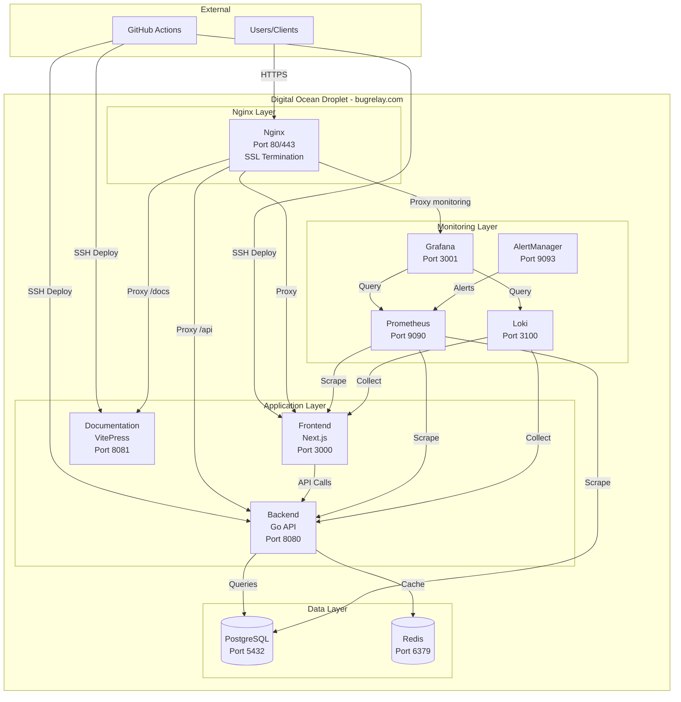

### Detailed Network Topology

```mermaid
graph LR
    subgraph "Internet"
        Internet[Internet Traffic]
    end
    
    subgraph "Digital Ocean Infrastructure"
        subgraph "Firewall - UFW"
            FW[Firewall Rules<br/>Allow: 22, 80, 443<br/>Deny: All Others]
        end
        
        subgraph "Droplet - 123.45.67.89"
            subgraph "Public Interface"
                ETH0[eth0<br/>Public IP]
            end
            
            subgraph "Docker Network - monitoring_network"
                DN[172.20.0.0/16]
                Grafana2[Grafana<br/>172.20.0.2]
                Prom[Prometheus<br/>172.20.0.3]
                Loki2[Loki<br/>172.20.0.4]
            end
            
            subgraph "Localhost Services"
                LH[127.0.0.1]
                Frontend2[Frontend:3000]
                Backend2[Backend:8080]
                PG[PostgreSQL:5432]
                RD[Redis:6379]
            end
        end
    end
    
    Internet -->|Port 80/443| FW
    FW -->|Allowed| ETH0
    ETH0 -->|Nginx| LH
    LH --> Frontend2
    LH --> Backend2
    LH --> DN
    Frontend2 --> Backend2
    Backend2 --> PG
    Backend2 --> RD
```

## Deployment Flow Diagrams

### CI/CD Deployment Flow

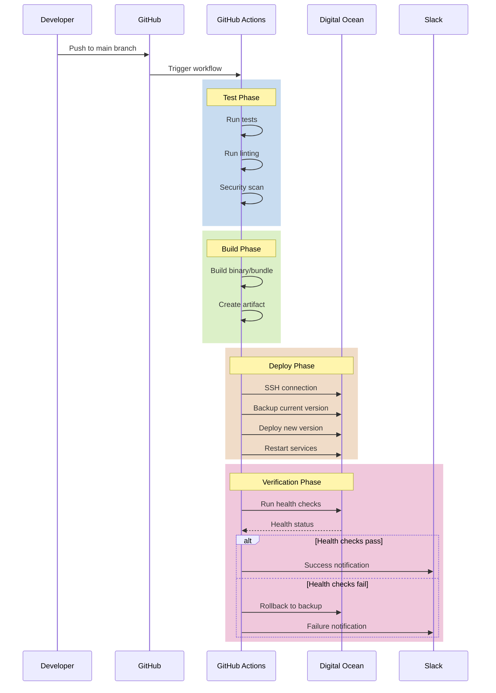

### Backend Blue-Green Deployment Flow

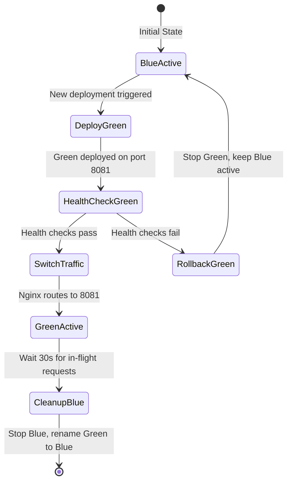

### Frontend Rolling Update Flow

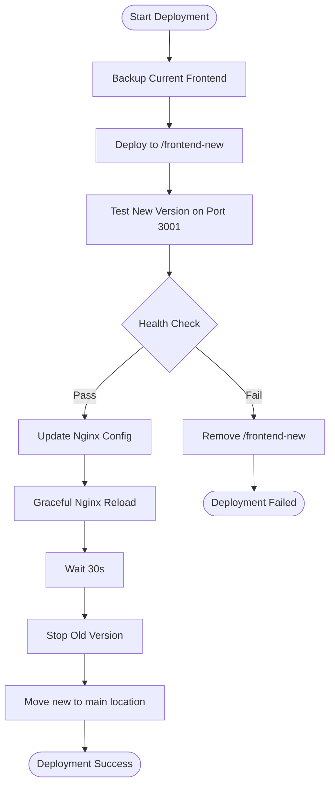

## Service Dependencies

### Service Dependency Graph

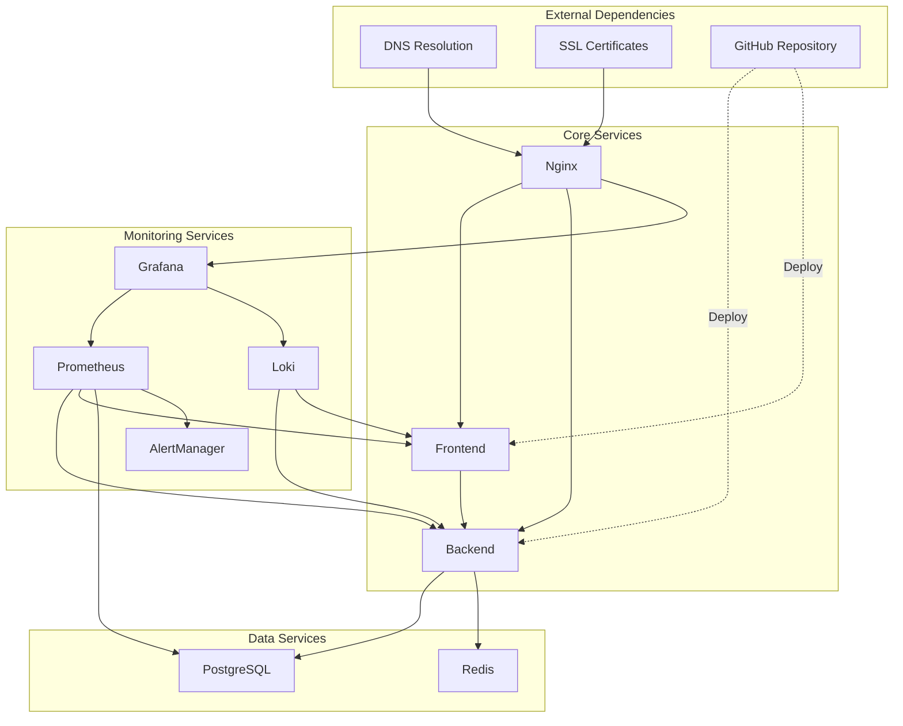

### Service Startup Order

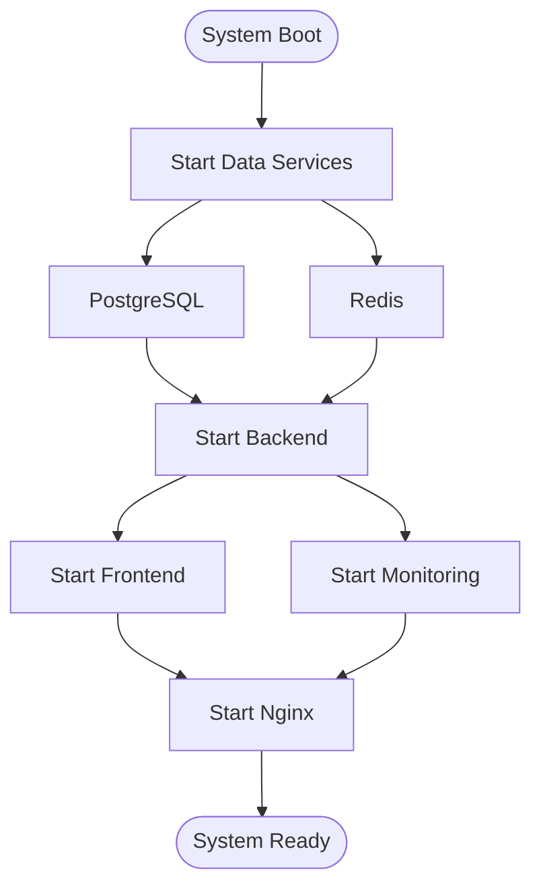

## Network Architecture

### Port Mapping

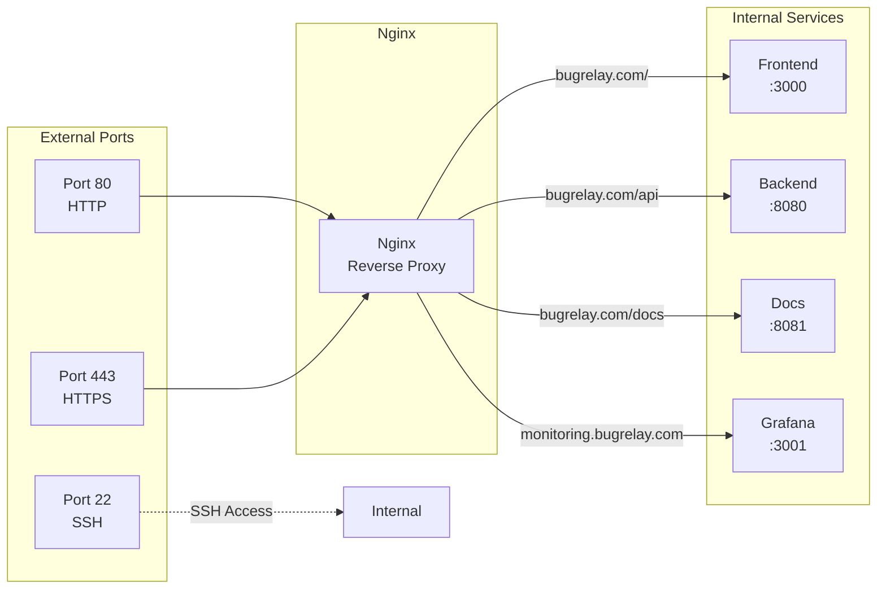

### Data Flow Architecture

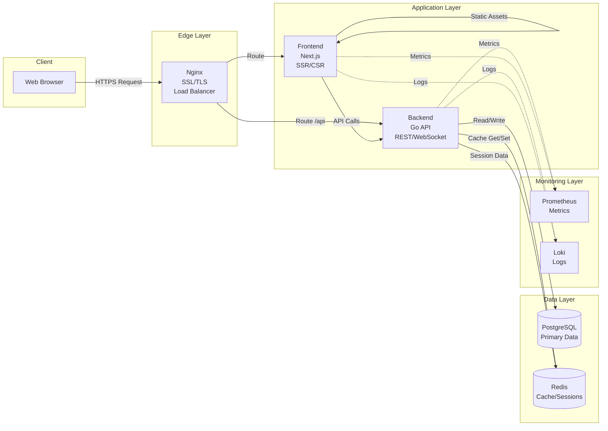

## Deployment Strategies

### Blue-Green Deployment (Backend)

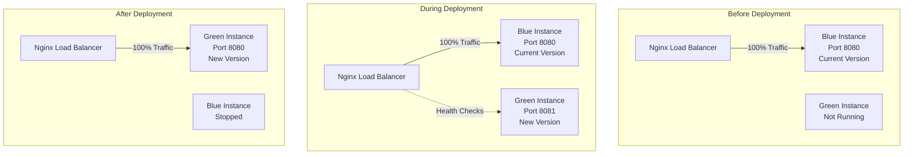

### Rolling Update (Frontend)

```mermaid
gantt
    title Frontend Rolling Update Timeline
    dateFormat  HH:mm:ss
    axisFormat %H:%M:%S
    
    section Preparation
    Backup Current Version    :done, prep1, 00:00:00, 10s
    Deploy New Version        :done, prep2, 00:00:10, 30s
    
    section Testing
    Health Check New Version  :done, test1, 00:00:40, 20s
    
    section Traffic Switch
    Update Nginx Config       :done, switch1, 00:01:00, 5s
    Graceful Nginx Reload     :done, switch2, 00:01:05, 5s
    
    section Cleanup
    Wait for In-Flight        :done, clean1, 00:01:10, 30s
    Stop Old Version          :done, clean2, 00:01:40, 10s
    Remove Old Files          :done, clean3, 00:01:50, 10s
```

## Monitoring Architecture

### Metrics Collection Flow

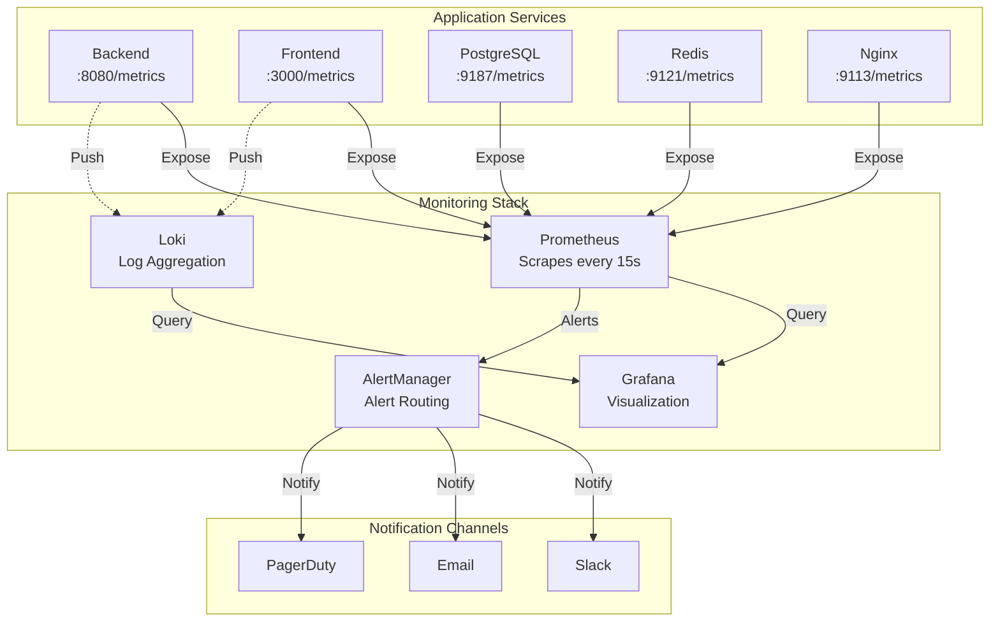

### Log Aggregation Flow

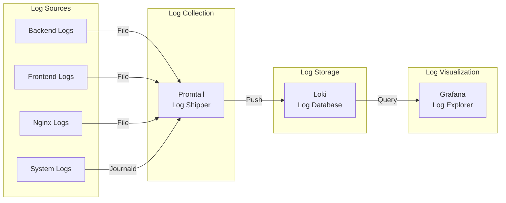

## Security Architecture

### Security Layers

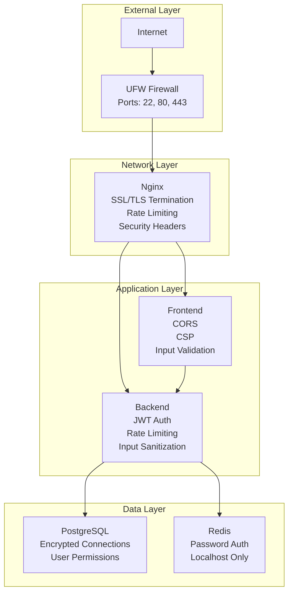

### Authentication Flow

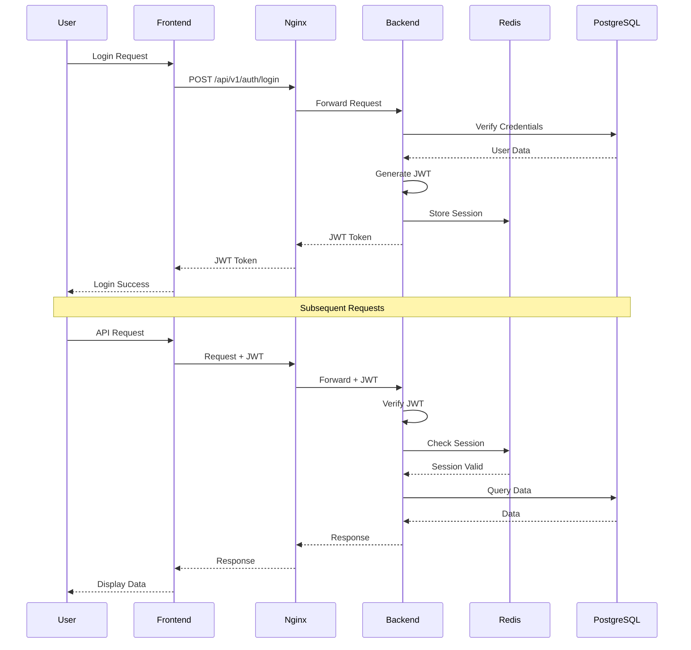

## Backup and Recovery Architecture

### Backup Strategy

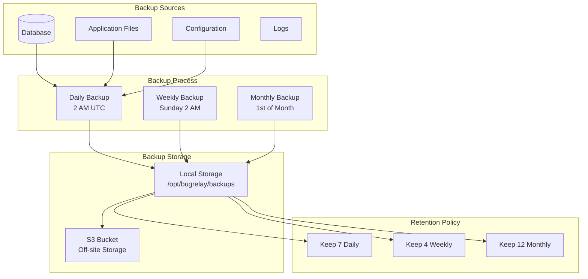

### Disaster Recovery Flow

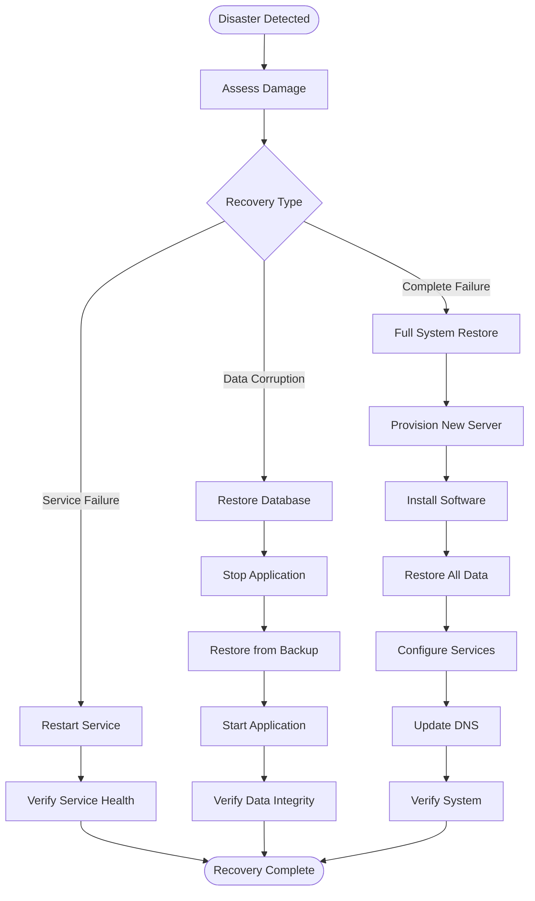

## Scaling Considerations

### Horizontal Scaling Architecture (Future)

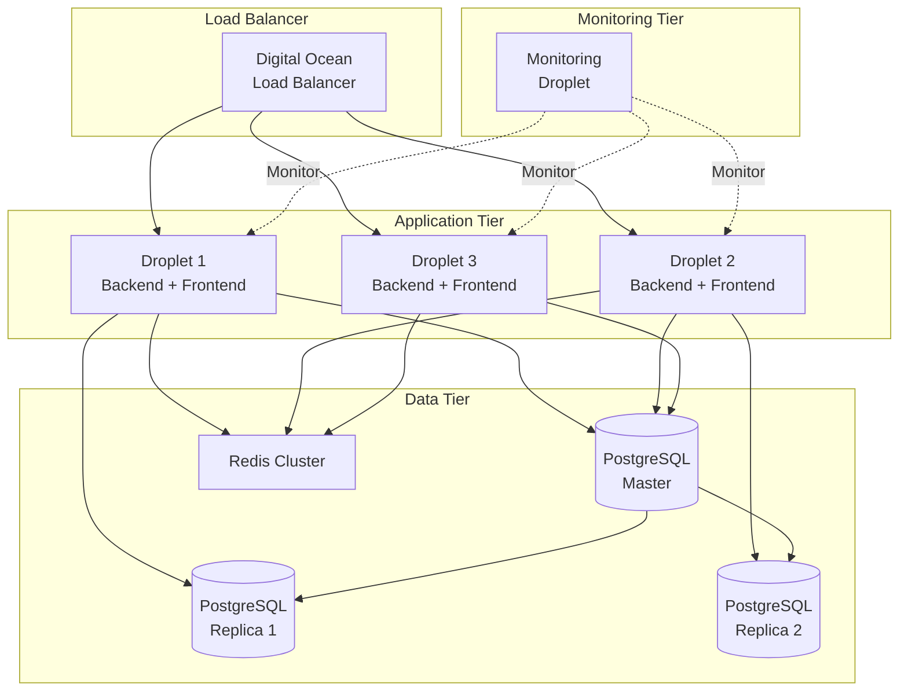

## Summary

This architecture provides:

- **High Availability**: Zero-downtime deployments with blue-green and rolling updates
- **Scalability**: Clear path to horizontal scaling when needed
- **Security**: Multiple layers of security from firewall to application
- **Observability**: Comprehensive monitoring and logging
- **Reliability**: Automated backups and disaster recovery procedures
- **Maintainability**: Clear service dependencies and deployment flows

## Related Documentation

- [Digital Ocean Setup Guide](setup-production.md) - Server setup procedures
- [CI/CD Workflows Guide](ci-cd-workflows.md) - Automated deployment workflows
- [Deployment Process Guide](deployment-process.md) - Deployment procedures
- [Troubleshooting Guide](troubleshooting.md) - Common issues and solutions

---

**Last Updated**: December 2024  
**Maintained By**: DevOps Team
