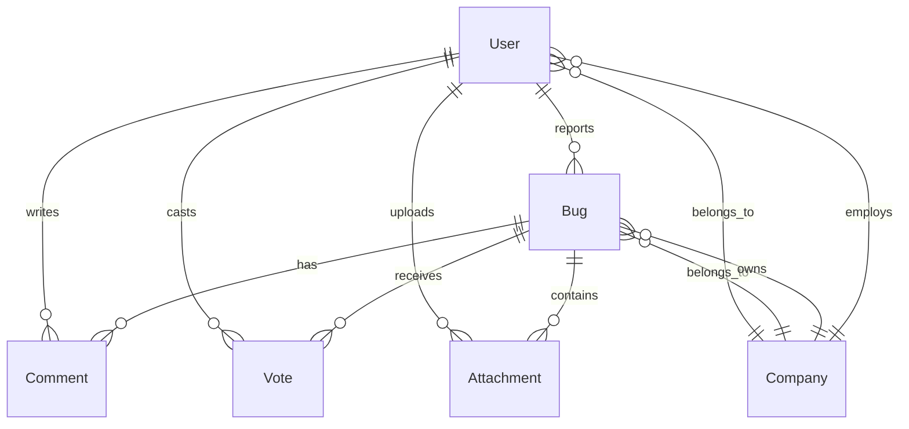

# Data Models

This section provides comprehensive documentation of all data structures used in the BugRelay API, including their relationships, validation rules, and JSON schemas.

## Overview

The BugRelay system uses several core data models:

- **[User](#user)** - User accounts and authentication
- **[Bug](#bug)** - Bug reports and tracking
- **[Company](#company)** - Organization and tenant management
- **[Comment](#comment)** - Bug report discussions
- **[Vote](#vote)** - Bug priority voting system
- **[Attachment](#attachment)** - File uploads and media

## Core Models

### User

Represents a user account in the system.

```json
{
  "id": "123e4567-e89b-12d3-a456-426614174000",
  "email": "user@example.com",
  "display_name": "John Doe",
  "is_email_verified": true,
  "is_admin": false,
  "company_id": "456e7890-e89b-12d3-a456-426614174000",
  "created_at": "2023-01-01T12:00:00Z",
  "updated_at": "2023-01-01T12:00:00Z"
}
```

**Fields:**
- `id` (UUID) - Unique user identifier
- `email` (string) - User's email address (unique)
- `display_name` (string) - User's display name
- `is_email_verified` (boolean) - Email verification status
- `is_admin` (boolean) - Administrative privileges
- `company_id` (UUID, optional) - Associated company
- `created_at` (timestamp) - Account creation time
- `updated_at` (timestamp) - Last update time

### Bug

Represents a bug report in the system.

```json
{
  "id": "123e4567-e89b-12d3-a456-426614174000",
  "title": "Login button not responsive",
  "description": "Detailed description of the issue...",
  "status": "open",
  "priority": "high",
  "application_id": "456e7890-e89b-12d3-a456-426614174000",
  "reporter_id": "789e0123-e89b-12d3-a456-426614174000",
  "assignee_id": null,
  "tags": ["mobile", "ios", "login"],
  "vote_count": 5,
  "comment_count": 3,
  "operating_system": "iOS 16.0",
  "device_type": "iPhone 13",
  "app_version": "2.1.0",
  "created_at": "2023-01-01T12:00:00Z",
  "updated_at": "2023-01-01T12:00:00Z"
}
```

**Fields:**
- `id` (UUID) - Unique bug identifier
- `title` (string) - Bug title (max 200 chars)
- `description` (string) - Detailed description
- `status` (enum) - Bug status: `open`, `in_progress`, `resolved`, `closed`
- `priority` (enum) - Priority level: `low`, `medium`, `high`, `critical`
- `application_id` (UUID) - Associated application
- `reporter_id` (UUID) - User who reported the bug
- `assignee_id` (UUID, optional) - Assigned developer
- `tags` (array) - Searchable tags
- `vote_count` (integer) - Number of votes
- `comment_count` (integer) - Number of comments
- `operating_system` (string, optional) - OS information
- `device_type` (string, optional) - Device information
- `app_version` (string, optional) - Application version

### Company

Represents an organization or tenant in the system.

```json
{
  "id": "123e4567-e89b-12d3-a456-426614174000",
  "name": "Acme Corporation",
  "domain": "acme.com",
  "is_verified": true,
  "settings": {
    "allow_anonymous_reports": false,
    "require_approval": true,
    "notification_email": "bugs@acme.com"
  },
  "created_at": "2023-01-01T12:00:00Z",
  "updated_at": "2023-01-01T12:00:00Z"
}
```

**Fields:**
- `id` (UUID) - Unique company identifier
- `name` (string) - Company name
- `domain` (string) - Company domain for verification
- `is_verified` (boolean) - Domain verification status
- `settings` (object) - Company-specific settings
- `created_at` (timestamp) - Company creation time
- `updated_at` (timestamp) - Last update time

### Comment

Represents a comment on a bug report.

```json
{
  "id": "123e4567-e89b-12d3-a456-426614174000",
  "bug_id": "456e7890-e89b-12d3-a456-426614174000",
  "author_id": "789e0123-e89b-12d3-a456-426614174000",
  "content": "I can reproduce this issue on Android as well.",
  "is_internal": false,
  "created_at": "2023-01-01T12:00:00Z",
  "updated_at": "2023-01-01T12:00:00Z"
}
```

**Fields:**
- `id` (UUID) - Unique comment identifier
- `bug_id` (UUID) - Associated bug report
- `author_id` (UUID) - Comment author
- `content` (string) - Comment text
- `is_internal` (boolean) - Internal team comment flag
- `created_at` (timestamp) - Comment creation time
- `updated_at` (timestamp) - Last update time

### Vote

Represents a user's vote on a bug report.

```json
{
  "id": "123e4567-e89b-12d3-a456-426614174000",
  "bug_id": "456e7890-e89b-12d3-a456-426614174000",
  "user_id": "789e0123-e89b-12d3-a456-426614174000",
  "type": "up",
  "created_at": "2023-01-01T12:00:00Z"
}
```

**Fields:**
- `id` (UUID) - Unique vote identifier
- `bug_id` (UUID) - Associated bug report
- `user_id` (UUID) - Voting user
- `type` (enum) - Vote type: `up`, `down`
- `created_at` (timestamp) - Vote creation time

### Attachment

Represents a file attachment on a bug report.

```json
{
  "id": "123e4567-e89b-12d3-a456-426614174000",
  "bug_id": "456e7890-e89b-12d3-a456-426614174000",
  "uploader_id": "789e0123-e89b-12d3-a456-426614174000",
  "filename": "screenshot.png",
  "content_type": "image/png",
  "size": 1024000,
  "url": "https://cdn.bugrelay.com/attachments/123e4567.png",
  "created_at": "2023-01-01T12:00:00Z"
}
```

**Fields:**
- `id` (UUID) - Unique attachment identifier
- `bug_id` (UUID) - Associated bug report
- `uploader_id` (UUID) - User who uploaded the file
- `filename` (string) - Original filename
- `content_type` (string) - MIME type
- `size` (integer) - File size in bytes
- `url` (string) - Download URL
- `created_at` (timestamp) - Upload time

## Relationships

### Entity Relationship Diagram



### Key Relationships

1. **User ↔ Company**: Many-to-one relationship where users belong to companies
2. **Bug ↔ User**: Many-to-one relationship where bugs are reported by users
3. **Bug ↔ Comments**: One-to-many relationship where bugs can have multiple comments
4. **Bug ↔ Votes**: One-to-many relationship where bugs can receive multiple votes
5. **Bug ↔ Attachments**: One-to-many relationship where bugs can have multiple file attachments

## Validation Rules

### Common Patterns

- **UUIDs**: All IDs use UUID v4 format
- **Timestamps**: ISO 8601 format with timezone (RFC 3339)
- **Emails**: RFC 5322 compliant email addresses
- **Strings**: UTF-8 encoded, trimmed of whitespace

### Field Constraints

| Field | Min Length | Max Length | Pattern |
|-------|------------|------------|---------|
| `email` | 5 | 254 | Valid email format |
| `display_name` | 2 | 100 | Alphanumeric + spaces |
| `bug.title` | 5 | 200 | Any printable characters |
| `bug.description` | 10 | 10000 | Any printable characters |
| `comment.content` | 1 | 2000 | Any printable characters |
| `company.name` | 2 | 100 | Alphanumeric + spaces |
| `company.domain` | 3 | 253 | Valid domain format |

### Enums

**Bug Status:**
- `open` - Newly reported, awaiting triage
- `in_progress` - Being actively worked on
- `resolved` - Fixed, awaiting verification
- `closed` - Verified as resolved or invalid

**Bug Priority:**
- `low` - Minor issue, low impact
- `medium` - Standard issue, moderate impact
- `high` - Important issue, significant impact
- `critical` - Urgent issue, system-breaking

**Vote Type:**
- `up` - Positive vote (increases priority)
- `down` - Negative vote (decreases priority)

## JSON Schemas

For complete JSON Schema definitions, see:

- [JSON Schemas Documentation](./schemas)
- [OpenAPI Specification](/api/openapi)

## Usage Examples

### Creating a Bug Report

```javascript
const bugData = {
  title: "Login form validation error",
  description: "The email validation allows invalid formats...",
  priority: "medium",
  application_id: "123e4567-e89b-12d3-a456-426614174000",
  tags: ["validation", "login", "frontend"],
  operating_system: "Windows 11",
  device_type: "Desktop",
  app_version: "1.2.3"
};

const response = await fetch('/api/v1/bugs', {
  method: 'POST',
  headers: {
    'Content-Type': 'application/json',
    'Authorization': 'Bearer ' + token
  },
  body: JSON.stringify(bugData)
});
```

### Filtering and Pagination

```javascript
// Get high priority bugs for a specific application
const params = new URLSearchParams({
  application_id: '123e4567-e89b-12d3-a456-426614174000',
  priority: 'high',
  status: 'open',
  page: '1',
  limit: '20',
  sort: 'created_at',
  order: 'desc'
});

const response = await fetch(`/api/v1/bugs?${params}`);
```

## Best Practices

1. **Always validate input** on both client and server side
2. **Use UUIDs** for all entity identifiers
3. **Include pagination** for list endpoints
4. **Implement proper error handling** for validation failures
5. **Use appropriate HTTP status codes** for different scenarios
6. **Include timestamps** for audit trails
7. **Sanitize user input** to prevent XSS attacks
8. **Use consistent naming conventions** across all models

For more detailed information about specific models, see the [Model Documentation](./data-models) page.