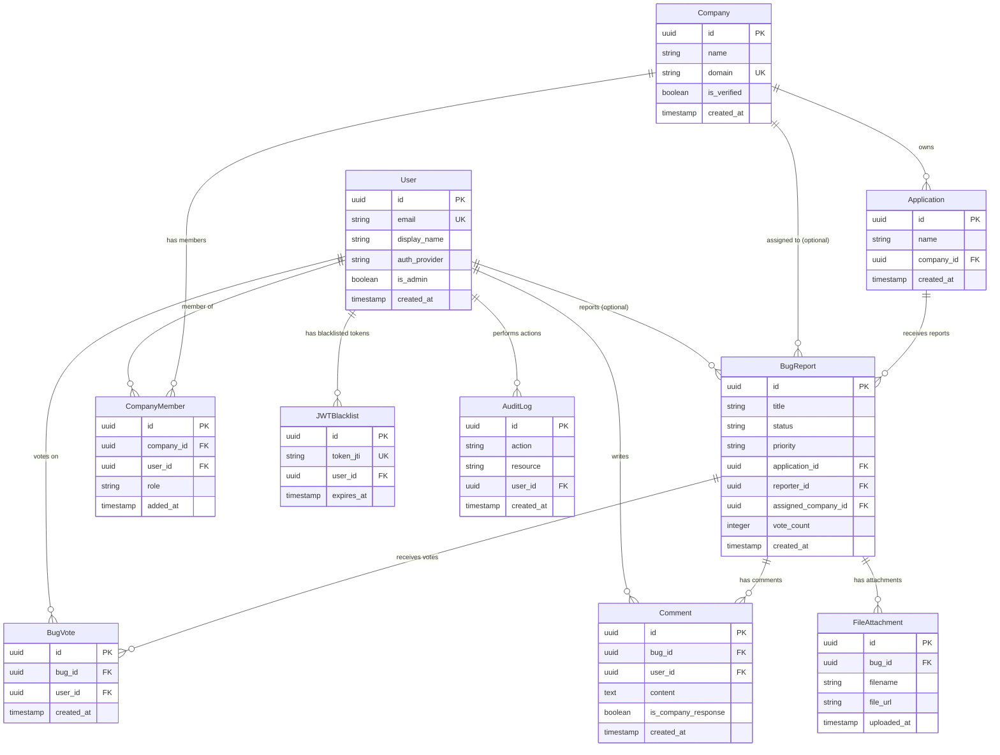

# Data Model Relationships

This document describes the relationships and associations between different data models in the BugRelay backend system.

## Entity Relationship Overview



## Detailed Relationship Descriptions

### User Relationships

#### User → BugReport (One-to-Many, Optional)
- **Relationship**: A user can submit multiple bug reports
- **Foreign Key**: `bug_reports.reporter_id` → `users.id`
- **Cardinality**: 1:N (optional)
- **Cascading**: When a user is deleted, their bug reports can remain (reporter_id becomes NULL)
- **Business Logic**: Anonymous bug reports are allowed (reporter_id = NULL)

```go
// Go model relationship
type User struct {
    SubmittedBugs []BugReport `gorm:"foreignKey:ReporterID"`
}
```

#### User → BugVote (One-to-Many)
- **Relationship**: A user can vote on multiple bug reports
- **Foreign Key**: `bug_votes.user_id` → `users.id`
- **Cardinality**: 1:N
- **Constraints**: UNIQUE(bug_id, user_id) - prevents duplicate votes
- **Cascading**: When a user is deleted, their votes are deleted

```go
// Go model relationship
type User struct {
    Votes []BugVote `gorm:"foreignKey:UserID"`
}
```

#### User → Comment (One-to-Many)
- **Relationship**: A user can write multiple comments
- **Foreign Key**: `comments.user_id` → `users.id`
- **Cardinality**: 1:N
- **Cascading**: When a user is deleted, their comments are deleted

```go
// Go model relationship
type User struct {
    Comments []Comment `gorm:"foreignKey:UserID"`
}
```

#### User → CompanyMember (One-to-Many)
- **Relationship**: A user can be a member of multiple companies
- **Foreign Key**: `company_members.user_id` → `users.id`
- **Cardinality**: 1:N
- **Constraints**: UNIQUE(company_id, user_id) - prevents duplicate memberships
- **Cascading**: When a user is deleted, their company memberships are deleted

```go
// Go model relationship
type User struct {
    CompanyMemberships []CompanyMember `gorm:"foreignKey:UserID"`
}
```

### Company Relationships

#### Company → Application (One-to-Many, Optional)
- **Relationship**: A company can own multiple applications
- **Foreign Key**: `applications.company_id` → `companies.id`
- **Cardinality**: 1:N (optional)
- **Business Logic**: Applications can exist without a company owner
- **Cascading**: When a company is deleted, applications become unowned (company_id = NULL)

```go
// Go model relationship
type Company struct {
    Applications []Application `gorm:"foreignKey:CompanyID"`
}
```

#### Company → CompanyMember (One-to-Many)
- **Relationship**: A company can have multiple members
- **Foreign Key**: `company_members.company_id` → `companies.id`
- **Cardinality**: 1:N
- **Cascading**: When a company is deleted, all memberships are deleted

```go
// Go model relationship
type Company struct {
    Members []CompanyMember `gorm:"foreignKey:CompanyID"`
}
```

#### Company → BugReport (One-to-Many, Optional)
- **Relationship**: A company can be assigned multiple bug reports
- **Foreign Key**: `bug_reports.assigned_company_id` → `companies.id`
- **Cardinality**: 1:N (optional)
- **Business Logic**: Bug reports can be unassigned
- **Cascading**: When a company is deleted, bug assignments are removed (assigned_company_id = NULL)

```go
// Go model relationship
type Company struct {
    AssignedBugs []BugReport `gorm:"foreignKey:AssignedCompanyID"`
}
```

### Application Relationships

#### Application → BugReport (One-to-Many)
- **Relationship**: An application can receive multiple bug reports
- **Foreign Key**: `bug_reports.application_id` → `applications.id`
- **Cardinality**: 1:N
- **Constraints**: NOT NULL - every bug report must be associated with an application
- **Cascading**: When an application is deleted, associated bug reports are deleted

```go
// Go model relationship
type Application struct {
    BugReports []BugReport `gorm:"foreignKey:ApplicationID"`
}
```

### BugReport Relationships

#### BugReport → BugVote (One-to-Many)
- **Relationship**: A bug report can receive multiple votes
- **Foreign Key**: `bug_votes.bug_id` → `bug_reports.id`
- **Cardinality**: 1:N
- **Cascading**: When a bug report is deleted, all votes are deleted

```go
// Go model relationship
type BugReport struct {
    Votes []BugVote `gorm:"foreignKey:BugID"`
}
```

#### BugReport → Comment (One-to-Many)
- **Relationship**: A bug report can have multiple comments
- **Foreign Key**: `comments.bug_id` → `bug_reports.id`
- **Cardinality**: 1:N
- **Cascading**: When a bug report is deleted, all comments are deleted

```go
// Go model relationship
type BugReport struct {
    Comments []Comment `gorm:"foreignKey:BugID"`
}
```

#### BugReport → FileAttachment (One-to-Many)
- **Relationship**: A bug report can have multiple file attachments
- **Foreign Key**: `file_attachments.bug_id` → `bug_reports.id`
- **Cardinality**: 1:N
- **Cascading**: When a bug report is deleted, all attachments are deleted

```go
// Go model relationship
type BugReport struct {
    Attachments []FileAttachment `gorm:"foreignKey:BugID"`
}
```

## Many-to-Many Relationships

### User ↔ Company (via CompanyMember)
- **Junction Table**: `company_members`
- **Relationship**: Users can be members of multiple companies, companies can have multiple users
- **Additional Fields**: 
  - `role` (member, admin)
  - `added_at` (timestamp)
- **Constraints**: UNIQUE(company_id, user_id)

```sql
-- Junction table structure
CREATE TABLE company_members (
    id UUID PRIMARY KEY,
    company_id UUID REFERENCES companies(id),
    user_id UUID REFERENCES users(id),
    role VARCHAR(20) DEFAULT 'member',
    added_at TIMESTAMP DEFAULT NOW(),
    UNIQUE(company_id, user_id)
);
```

### User ↔ BugReport (via BugVote)
- **Junction Table**: `bug_votes`
- **Relationship**: Users can vote on multiple bug reports, bug reports can receive votes from multiple users
- **Additional Fields**: 
  - `created_at` (timestamp)
- **Constraints**: UNIQUE(bug_id, user_id) - prevents duplicate votes

```sql
-- Junction table structure
CREATE TABLE bug_votes (
    id UUID PRIMARY KEY,
    bug_id UUID REFERENCES bug_reports(id),
    user_id UUID REFERENCES users(id),
    created_at TIMESTAMP DEFAULT NOW(),
    UNIQUE(bug_id, user_id)
);
```

## Cascading Rules and Data Integrity

### Deletion Cascading Rules

1. **User Deletion**:
   - `bug_votes` → CASCADE DELETE (votes are removed)
   - `comments` → CASCADE DELETE (comments are removed)
   - `company_members` → CASCADE DELETE (memberships are removed)
   - `jwt_blacklist` → CASCADE DELETE (tokens are invalidated)
   - `audit_logs` → CASCADE DELETE (audit trail is maintained)
   - `bug_reports.reporter_id` → SET NULL (anonymous reports)

2. **Company Deletion**:
   - `applications.company_id` → SET NULL (applications become unowned)
   - `company_members` → CASCADE DELETE (memberships are removed)
   - `bug_reports.assigned_company_id` → SET NULL (bugs become unassigned)

3. **Application Deletion**:
   - `bug_reports` → CASCADE DELETE (all associated bug reports are removed)

4. **BugReport Deletion** (Soft Delete):
   - `bug_votes` → CASCADE DELETE (votes are removed)
   - `comments` → CASCADE DELETE (comments are removed)
   - `file_attachments` → CASCADE DELETE (attachments are removed)

### Referential Integrity Constraints

1. **Required Relationships**:
   - Every bug report must have an application (`application_id NOT NULL`)
   - Every vote must have a user and bug report
   - Every comment must have a user and bug report
   - Every company member must have a company and user

2. **Optional Relationships**:
   - Bug reports can be anonymous (`reporter_id` can be NULL)
   - Bug reports can be unassigned (`assigned_company_id` can be NULL)
   - Applications can be unowned (`company_id` can be NULL)

3. **Unique Constraints**:
   - Users cannot vote multiple times on the same bug
   - Users cannot have duplicate memberships in the same company
   - Company domains must be unique
   - User emails must be unique

## Query Patterns and Performance

### Common Join Patterns

1. **Bug Report with Details**:
```sql
SELECT br.*, a.name as app_name, u.display_name as reporter_name, c.name as company_name
FROM bug_reports br
JOIN applications a ON br.application_id = a.id
LEFT JOIN users u ON br.reporter_id = u.id
LEFT JOIN companies c ON br.assigned_company_id = c.id;
```

2. **User's Bug Reports with Vote Counts**:
```sql
SELECT br.*, COUNT(bv.id) as vote_count
FROM bug_reports br
LEFT JOIN bug_votes bv ON br.id = bv.bug_id
WHERE br.reporter_id = ?
GROUP BY br.id;
```

3. **Company Dashboard Data**:
```sql
SELECT c.*, COUNT(DISTINCT a.id) as app_count, COUNT(DISTINCT br.id) as bug_count
FROM companies c
LEFT JOIN applications a ON c.id = a.company_id
LEFT JOIN bug_reports br ON c.id = br.assigned_company_id
WHERE c.id = ?
GROUP BY c.id;
```

### Relationship-Based Indexes

1. **Foreign Key Indexes**: All foreign key columns are indexed for efficient joins
2. **Composite Indexes**: Multi-column indexes for common relationship queries
3. **Unique Indexes**: Enforce relationship constraints and improve lookup performance

## Data Model Evolution

### Migration Considerations

1. **Adding Relationships**: New foreign keys should be added with appropriate indexes
2. **Removing Relationships**: Consider data migration before dropping foreign keys
3. **Changing Cardinality**: May require data restructuring and application logic changes
4. **Index Maintenance**: Relationship changes may require index updates

### Backward Compatibility

1. **Optional Relationships**: New optional foreign keys maintain backward compatibility
2. **Required Relationships**: New required foreign keys need data migration
3. **Constraint Changes**: Unique constraint additions may require data cleanup
4. **Cascading Changes**: Modifications to cascading rules affect data integrity